<div align="center">

<picture>
  <source media="(prefers-color-scheme: dark)" srcset="docs/assets/wordmark-dark.png" />
  
</picture>

<br/>

### Controle seu dinheiro em 5 segundos por dia, só conversando.

App de organização de finanças pessoais com IA, concebido com **Vibe Coding** para o desafio da [DIO](https://www.dio.me/).


[**🚀 Ver o app ao vivo**](LINK_DO_APP_NO_LOVABLE) · [**📄 PRD completo**](PRD-Tostao-App-Financas.md) · [**🎬 Vídeo de demonstração**](LINK_DO_VIDEO)

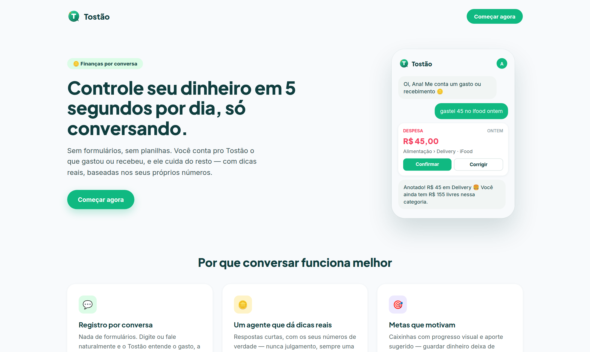

</div>

---

## 📑 Sumário

1. [Resumo executivo](#-resumo-executivo)
2. [O problema](#-o-problema)
3. [A solução](#-a-solução)
4. [Funcionalidades do MVP](#-funcionalidades-do-mvp)
5. [Conheça o agente Tostão](#-conheça-o-agente-tostão)
6. [Identidade visual](#-identidade-visual)
7. [Fluxo de telas](#-fluxo-de-telas)
8. [Arquitetura e stack](#-arquitetura-e-stack)
9. [Processo de Vibe Coding](#-processo-de-vibe-coding)
10. [Prompt final (PRD)](#-prompt-final-prd)
11. [Plano de validação do MVP](#-plano-de-validação-do-mvp)
12. [Roadmap](#-roadmap)
13. [Reflexão: o que aprendi](#-reflexão-o-que-aprendi)
14. [Como executar localmente](#-como-executar-localmente)
15. [Autor](#-autor)

---

## 🎯 Resumo executivo

O **Tostão** é um web app mobile-first em que o usuário organiza as finanças **conversando com um agente de IA**, em vez de preencher formulários. Basta escrever *"gastei 45 no iFood ontem"* e o app registra, categoriza e atualiza o painel. O agente cria um **plano de economia personalizado**, acompanha **metas ("caixinhas")** e dá **dicas com base nos números reais** do usuário.

| | |
|---|---|
| **Público-alvo** | Iniciantes em organização financeira, 20–40 anos, que usam Pix no dia a dia |
| **Diferencial** | Registro por linguagem natural brasileira + agente proativo, não só gráficos |
| **Métrica norte** | % de usuários que registram gastos em 4+ dias por semana |
| **Status** | MVP funcional gerado com Lovable, pronto para teste com usuários |

---

## 😩 O problema

> *"Baixei três apps de finanças. Usei cada um por uma semana."*

- **Atrito alto:** registrar cada gasto em formulários com 5 campos é cansativo, e a maioria desiste em poucas semanas.
- **Orçamento é visto como punição:** planilhas e limites parecem técnicos e chatos.
- **Dados sem direção:** os apps mostram gráficos, mas não dizem **o que fazer** com eles.

## 💡 A solução

Trocar o formulário pela **conversa** e o gráfico passivo por um **consultor ativo**.

| Antes (apps tradicionais) | Com o Tostão |
|---|---|
| Abrir app → tocar em "+" → preencher valor, categoria, data, conta, descrição | Escrever *"uber 23,90 e padaria 12"* → confirmar |
| Escolher a categoria manualmente | IA categoriza e **aprende** com as correções |
| Criar orçamento do zero | Plano 50/30/20 gerado em 4 perguntas no onboarding |
| Descobrir o estouro no fim do mês | Alerta em 80% do limite, com sugestão de ação |
| Gráficos sem interpretação | Cada gráfico acompanha um insight em linguagem simples |

---

## ✨ Funcionalidades do MVP

| # | Funcionalidade | Como funciona |
|---|---|---|
| **F1** | 💬 Registro por chat e voz | Entende gírias e múltiplos gastos numa frase (*"50 conto de gasolina"*); card de confirmação editável com um toque |
| **F2** | 🏷️ Categorização inteligente | Sugere a categoria, aprende regras com as correções e detecta assinaturas recorrentes |
| **F3** | 🎯 Caixinhas (metas) | *"Quero juntar 5 mil pra viajar em dezembro"* vira meta com aporte mensal calculado e progresso visual |
| **F4** | 🤖 Agente Tostão | Plano de economia personalizado, alertas de limite, resumo semanal e respostas sobre os próprios dados |
| **F5** | 📊 Relatórios com insights | Painel "Livre para gastar", gráficos por categoria e mês, comparação com o mês anterior |

<details>
<summary><b>🧪 Exemplos de interpretação de linguagem natural</b></summary>

| O usuário escreve | O Tostão registra |
|---|---|
| `gastei 45 no ifood ontem` | Despesa · R$ 45,00 · Alimentação › Delivery · ontem |
| `paguei 1200 de aluguel` | Despesa · R$ 1.200,00 · Moradia › Aluguel · hoje |
| `caiu o salário, 3.500` | Receita · R$ 3.500,00 · Salário · hoje |
| `uber 23,90 e padaria 12` | **Duas** despesas: Transporte e Alimentação |
| `guardei 200 na viagem` | Aporte de R$ 200,00 na caixinha "Viagem" |
| `posso gastar 300 num tênis?` | Resposta considerando saldo, limites e metas |

</details>

---

## 🤖 Conheça o agente Tostão

Um consultor financeiro **amigo e educador, nunca julgador**.

- Celebra o progresso antes de apontar problemas.
- Toda crítica vem com **uma ação pequena e concreta**.
- Usa **números reais** do usuário, nunca exemplos genéricos.
- Não recomenda produtos financeiros; em decisões complexas, indica um profissional.

> **Registro:** *"Anotado! R$ 45 em Delivery 🍔 Você ainda tem R$ 155 livres nessa categoria."*
>
> **Alerta:** *"Opa, Lazer já está em 80% do limite e ainda faltam 12 dias. Quer que eu ajuste o plano ou seguimos firmes?"*
>
> **Conquista:** *"Caixinha Viagem chegou a 50%! No ritmo atual você bate a meta em novembro, um mês antes do prazo."*

<p align="center">
  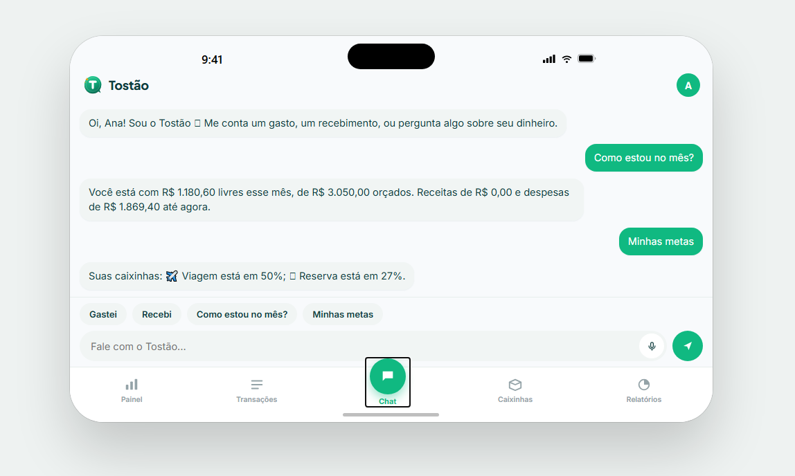
  
</p>

---

## 🎨 Identidade visual

<table>
<tr>
<td width="220" align="center">
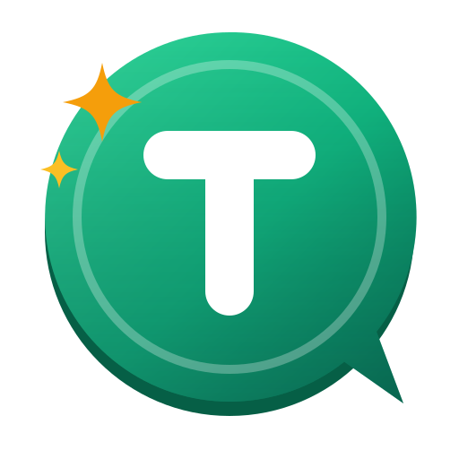
</td>
<td>

**O conceito da marca**

O ícone une três ideias em uma só forma:

- 🪙 **Moeda:** o círculo com borda interna e espessura remete ao dinheiro do dia a dia, e o nome vem do tostão, antiga moeda brasileira.
- 💬 **Balão de conversa:** a ponta no canto inferior representa o chat, o coração da experiência.
- ✨ **Brilho âmbar:** sinaliza a inteligência artificial e os momentos de conquista.

O "T" em traço arredondado e o verde-esmeralda transmitem acolhimento e crescimento, longe da frieza dos bancos tradicionais.

</td>
</tr>
</table>

**Variações da marca**

| Wordmark (fundo claro) | Wordmark (fundo escuro) |
|:---:|:---:|
|  |  |

| Ícone do app (512px) | PWA (192px) | Favicon (32px) |
|:---:|:---:|:---:|
|  |  |  |

**Paleta de cores**

| Amostra | Hex | Uso |
|:---:|---|---|
|  | `#10B981` | Primária: marca, botões e progresso |
|  | `#0F3D3E` | Secundária: títulos e textos de destaque |
|  | `#F59E0B` | Destaque: IA, alertas e conquistas |
|  | `#22C55E` | Receitas |
|  | `#F43F5E` | Despesas |
|   | `#F8FAFC` / `#0B1215` | Fundos claro e escuro |

**Tipografia:** [Plus Jakarta Sans](https://fonts.google.com/specimen/Plus+Jakarta+Sans) na marca, títulos e valores · [Inter](https://fonts.google.com/specimen/Inter) nos textos da interface.

---

## 🗺️ Fluxo de telas

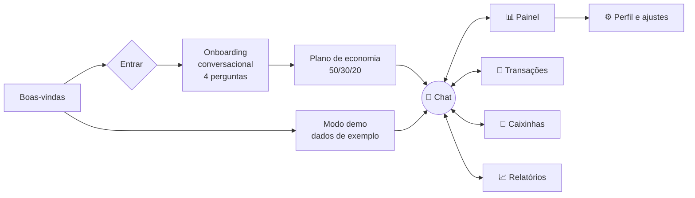

| Onboarding | Chat | Painel | Caixinhas | Relatórios |
|:---:|:---:|:---:|:---:|:---:|
| 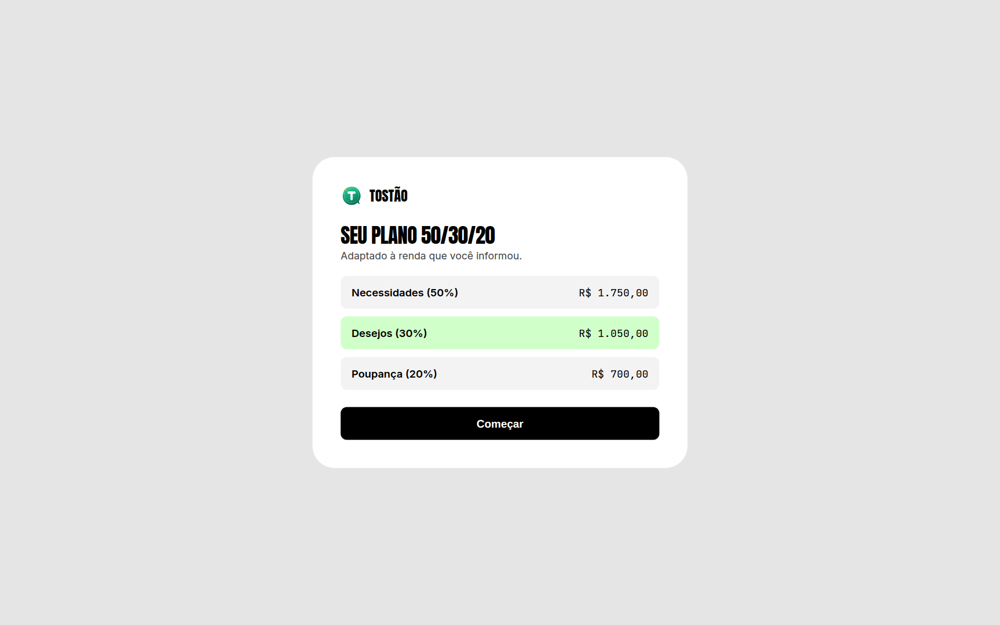 |  | 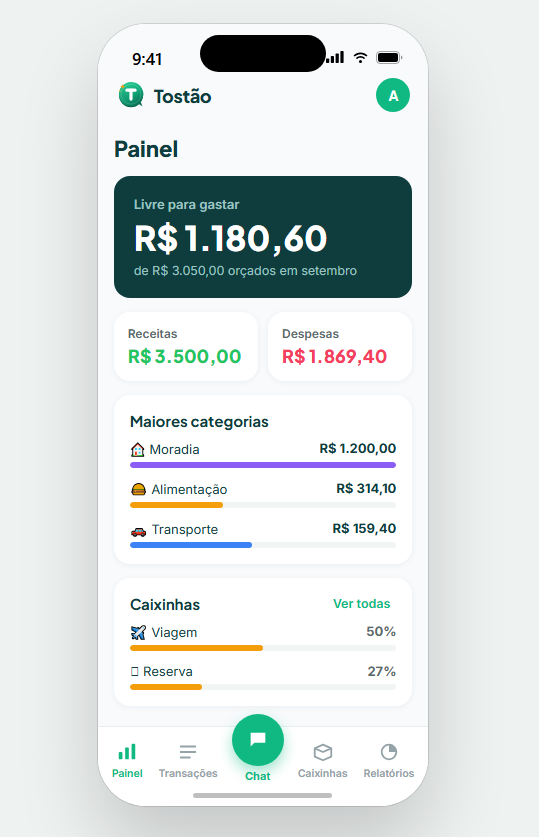 | 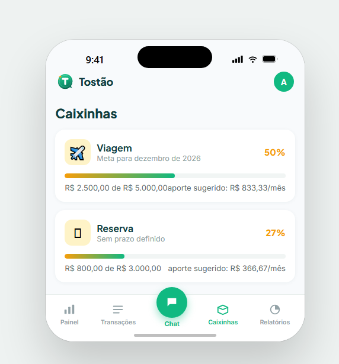 | 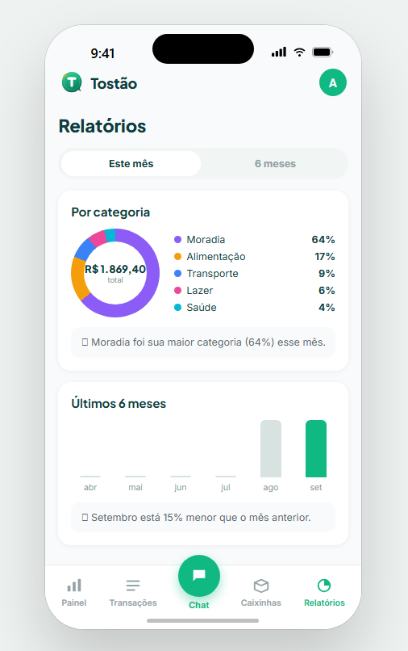 |

---

## 🏗️ Arquitetura e stack

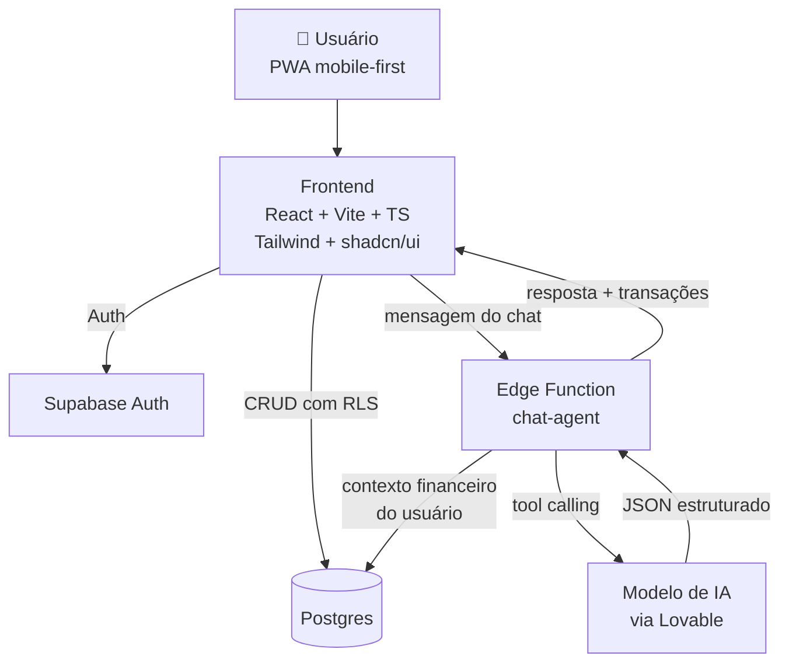

| Camada | Tecnologias |
|---|---|
| Interface | React, TypeScript, Vite, Tailwind CSS, shadcn/ui, Framer Motion, Recharts |
| Backend | Lovable Cloud (Supabase): Auth, Postgres com Row Level Security, Edge Functions |
| IA | Integração de IA do Lovable com *tool calling* retornando JSON validado |
| Entrega | PWA instalável, deploy pelo Lovable |

**Decisões de produto e engenharia**

- **IA no servidor, nunca no navegador:** a chamada ao modelo passa por uma Edge Function, então nenhuma chave fica exposta.
- **Saída estruturada:** o agente devolve JSON (`intencao`, `transacoes`, `meta`, `aporte`, `resposta`), o que torna o registro previsível e testável.
- **Confirmação humana:** nada entra no banco sem o usuário confirmar o card, o que evita erros silenciosos da IA.
- **Privacidade (LGPD):** RLS por usuário, exportação e exclusão de todos os dados pelo perfil.

<details>
<summary><b>🗄️ Modelo de dados</b></summary>

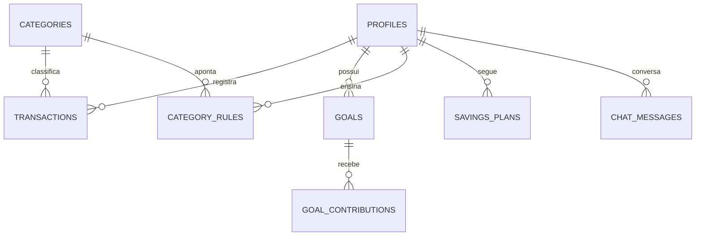

</details>

---

## 🪄 Processo de Vibe Coding

O projeto foi construído **sem escrever código manualmente**: o trabalho foi definir intenção, contexto e critérios claros para a IA.

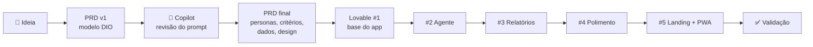

| Etapa | Ferramenta | O que foi feito | Registro |
|---|---|---|---|
| 1 | Copilot | Revisão do PRD inicial: clareza, escopo e critérios de aceite |  |
| 2 | Lovable #1 | Geração da base: auth, chat, painel, transações, caixinhas, modo demo |  |
| 3 | Lovable #2 | Agente Tostão, onboarding e plano 50/30/20 |  |
| 4 | Lovable #3 | Relatórios com insights e detecção de recorrência |  |
| 5 | Lovable #4 | Polimento: animações, estados vazios, acessibilidade, dark mode |  |
| 6 | Lovable #5 | Landing page pública e PWA |  |

> 🎬 **Vídeo das interações:** [assista aqui](LINK_DO_VIDEO)

**Estratégia para o limite de 5 interações diárias do Lovable:** em vez de pedidos curtos e vagos, cada interação recebeu um bloco de escopo fechado, referenciando seções numeradas do PRD (*"implemente conforme a seção 5"*). Isso transformou o PRD em um contrato que a IA consultava a cada etapa.

---

## 📝 Prompt final (PRD)

O PRD completo também está disponível em [`PRD-Tostao-App-Financas.md`](PRD-Tostao-App-Financas.md).

<details>
<summary><b>📄 Clique para expandir o prompt principal enviado ao Lovable</b></summary>

### 1. Visão do produto

Crie o **Tostão**, um web app mobile-first de organização de finanças pessoais em que o usuário controla o dinheiro **conversando**, sem formulários nem planilhas. O usuário escreve (ou fala) coisas como *"gastei 45 no iFood ontem"* e o app registra, categoriza e atualiza tudo sozinho. Um agente de IA, o **Tostão**, age como um consultor financeiro amigo: cria um plano de economia personalizado, acompanha metas e dá dicas práticas no momento certo.

**Proposta de valor em uma frase:** *"Controle seu dinheiro em 5 segundos por dia, só conversando."*

Todo o app deve estar em **português do Brasil**, com moeda em **R$** (formato `R$ 1.234,56`) e datas em `dd/mm/aaaa`.

### 2. Problema

- Pessoas abandonam apps de finanças em poucas semanas porque registrar cada gasto em formulários é cansativo.
- Orçamentos são vistos como algo técnico, chato e punitivo.
- Os apps mostram números, mas não dizem **o que fazer** com eles.

### 3. Público-alvo e personas

| Persona | Perfil | Dor principal | O que o Tostão entrega |
|---|---|---|---|
| **Ana, 24** | Primeiro emprego CLT, usa Pix pra tudo | "Meu salário some e não sei onde" | Registro rápido por chat e resumo semanal claro |
| **Carlos, 38** | Autônomo, renda variável | "Nunca sei quanto posso gastar no mês" | Orçamento flexível baseado na média de renda |
| **Juliana, 31** | Quer juntar para uma viagem | "Começo a guardar e desisto" | Metas com progresso visual e plano automático de aporte |

Foco do MVP: **iniciantes em organização financeira**.

### 4. Funcionalidades do MVP (escopo fechado)

#### F1 — Registro de transações por chat em linguagem natural
- Campo de chat fixo na parte inferior, estilo mensageiro, sempre acessível.
- Interpretar frases informais do dia a dia brasileiro, incluindo gírias e abreviações:
  - "gastei 45 no ifood ontem" → Despesa · R$ 45,00 · Alimentação › Delivery · data de ontem
  - "paguei 1200 de aluguel" → Despesa · R$ 1.200,00 · Moradia › Aluguel · hoje
  - "caiu o salário, 3.500" → Receita · R$ 3.500,00 · Salário · hoje
  - "uber 23,90 e padaria 12" → **duas** transações separadas
  - "50 conto de gasolina" → Despesa · R$ 50,00 · Transporte › Combustível
- Após interpretar, o agente responde com um **card de confirmação** contendo valor, categoria, data e descrição, cada um editável com um toque (chips clicáveis), e botões **Confirmar** / **Corrigir**.
- Se faltar informação essencial (ex.: valor), o agente faz **uma única pergunta curta**.
- Botão de microfone para entrada por voz (Web Speech API, pt-BR), com fallback silencioso se o navegador não suportar.
- Atalhos rápidos acima do teclado: "Gastei", "Recebi", "Como estou no mês?", "Minhas metas".

#### F2 — Classificação automática
- Categorias padrão com ícone e cor: Alimentação, Mercado, Transporte, Moradia, Contas (luz/água/internet), Saúde, Educação, Lazer, Compras, Assinaturas, Pets, Salário, Freelance, Outros.
- A IA sugere a categoria; quando o usuário corrige, o app **aprende a preferência** (ex.: "Padaria do Zé" passa a ser sempre Alimentação) salvando uma regra de mapeamento descrição → categoria para aquele usuário.
- Detecção de gasto recorrente (mesmo estabelecimento e valor semelhante em meses seguidos) com sugestão: *"Isso parece uma assinatura. Quer que eu marque como recorrente?"*

#### F3 — Metas financeiras ("Caixinhas")
- Criar meta pelo chat: *"quero juntar 5 mil pra viajar em dezembro"* → o agente calcula o aporte mensal necessário e cria a caixinha.
- Cada caixinha tem nome, emoji, valor-alvo, prazo, valor acumulado e barra de progresso.
- Registrar aporte pelo chat: *"guardei 200 na viagem"*.
- Celebração visual (confete sutil) ao atingir 25%, 50%, 75% e 100%.

#### F4 — Agente Financeiro "Tostão" e plano de economia automático
- No onboarding, o agente cria um **plano de economia personalizado** a partir de renda, gastos fixos e objetivo principal, usando como base a regra **50/30/20** (necessidades/desejos/futuro) adaptada à realidade do usuário.
- Define **limites por categoria** e avisa proativamente quando o usuário atinge 80% e 100% de um limite.
- Gera **dicas contextuais** baseadas nos dados reais, nunca genéricas. Exemplo: *"Você gastou R$ 380 com delivery este mês, 40% a mais que em agosto. Cozinhar duas vezes a mais por semana já libera uns R$ 150 para sua caixinha da viagem."*
- **Resumo semanal** automático no chat toda segunda-feira (ou ao abrir o app pela primeira vez na semana).
- Responde perguntas sobre os próprios dados: *"quanto gastei com uber esse mês?"*, *"posso gastar 300 num tênis?"* (resposta considera saldo, limites e metas).

#### F5 — Relatórios simples e visuais
- **Home (Painel):** saldo do mês, quanto ainda pode gastar ("Livre para gastar"), receitas × despesas, 3 maiores categorias e progresso das caixinhas.
- **Relatórios:** gráfico de rosca por categoria, gráfico de barras dos últimos 6 meses, comparação com o mês anterior e filtro por período.
- Todo gráfico acompanha **uma frase de insight** escrita pelo agente (ex.: *"Lazer caiu 22% — bom trabalho!"*).

#### Fora do escopo do MVP
Integração bancária / Open Finance, leitura de extrato em PDF, investimentos, cartões de crédito com fatura, múltiplas moedas, contas compartilhadas. Esses itens entram no roadmap (seção 12).

### 5. Personalidade do agente Tostão

- **Papel:** consultor financeiro pessoal, amigo e educador — nunca julgador.
- **Tom:** próximo, leve, bem-humorado na medida, frases curtas, português brasileiro coloquial mas correto. Usa no máximo 1 emoji por mensagem.
- **Princípios:**
  1. Celebra progresso antes de apontar problemas.
  2. Toda crítica vem acompanhada de uma ação concreta e pequena.
  3. Usa números reais do usuário, nunca exemplos genéricos.
  4. Explica termos financeiros de forma simples quando aparecem (reserva de emergência, juros compostos etc.).
  5. Não recomenda produtos financeiros específicos, bancos ou ações; para decisões complexas, sugere procurar um profissional.
  6. Respostas com no máximo 3 frases, salvo quando o usuário pedir detalhes.
- **Exemplos de fala:**
  - Registro: *"Anotado! R$ 45 em Delivery 🍔 Você ainda tem R$ 155 livres nessa categoria."*
  - Alerta: *"Opa, Lazer já está em 80% do limite e ainda faltam 12 dias. Quer que eu ajuste o plano ou seguimos firmes?"*
  - Conquista: *"Caixinha Viagem chegou a 50%! No ritmo atual você bate a meta em novembro, um mês antes do prazo."*

**System prompt do agente (usar na chamada de IA):**
```
Você é o Tostão, agente financeiro pessoal do app Tostão. Fale em português do Brasil, com tom amigo, leve e encorajador, em no máximo 3 frases. Sua função é: (1) interpretar mensagens do usuário e extrair transações, metas e aportes em JSON estruturado; (2) responder perguntas usando SOMENTE os dados financeiros fornecidos no contexto; (3) dar dicas práticas e personalizadas com números reais. Nunca invente valores. Nunca recomende produtos financeiros específicos. Se faltar o valor de uma transação, faça uma única pergunta curta.
```

**Formato de saída estruturada da interpretação (tool calling / JSON):**
```json
{
  "intencao": "registrar_transacao | criar_meta | aportar_meta | consulta | conversa",
  "transacoes": [
    { "tipo": "despesa|receita", "valor": 45.00, "categoria": "Alimentação", "subcategoria": "Delivery", "descricao": "iFood", "data": "2026-09-27" }
  ],
  "meta": { "nome": "Viagem", "valor_alvo": 5000, "prazo": "2026-12-31", "emoji": "✈️" },
  "aporte": { "meta_nome": "Viagem", "valor": 200 },
  "resposta": "texto curto para o usuário"
}
```

### 6. Fluxo de telas

1. **Splash / Boas-vindas** — logo, slogan e botão "Começar".
2. **Cadastro / Login** — e-mail e senha ou Google.
3. **Onboarding conversacional** (dentro do próprio chat, 4 perguntas):
   1. "Como posso te chamar?"
   2. "Quanto você recebe por mês, mais ou menos?" (aceita faixa ou "é variável")
   3. "Quais são seus gastos fixos principais?" (chips: aluguel, contas, internet, transporte, escola…)
   4. "Qual seu maior objetivo agora?" (chips: sair das dívidas, criar reserva, juntar pra algo, só organizar)
   → O Tostão apresenta o **plano de economia** em um card resumido e pede confirmação.
4. **Chat (tela principal)** — conversa com o Tostão, cards de confirmação, atalhos rápidos, microfone.
5. **Painel** — visão do mês (seção F5).
6. **Transações** — lista agrupada por dia, busca, filtro por categoria, deslizar para editar/excluir.
7. **Caixinhas** — lista de metas com progresso; detalhe com histórico de aportes.
8. **Relatórios** — gráficos e insights.
9. **Perfil / Ajustes** — nome, renda, limites por categoria, categorias personalizadas, tema claro/escuro, exportar CSV, sair.

**Navegação:** barra inferior com 5 abas — Chat (central e destacada), Painel, Transações, Caixinhas, Relatórios. Perfil no avatar do topo.

### 7. Design e identidade visual

- **Estilo:** fintech moderna, limpa, acolhedora — referência de qualidade: Nubank, Revolut, Monzo.
- **Cores:**
  - Primária: verde-esmeralda `#10B981` (dinheiro, crescimento)
  - Secundária: azul-petróleo profundo `#0F3D3E`
  - Destaque: âmbar `#F59E0B` (alertas e conquistas)
  - Despesa: coral `#F43F5E` · Receita: verde `#22C55E`
  - Fundo claro `#F8FAFC` · Fundo escuro `#0B1215`
- **Tipografia:** Inter (textos) e Plus Jakarta Sans (títulos e valores grandes); números com `tabular-nums`.
- **Componentes:** cantos arredondados (16px em cards), sombras suaves, microinterações com Framer Motion (entrada de mensagens, contagem animada de valores, barras de progresso), skeletons durante carregamento.
- **Mascote/ícone:** uma moeda simpática estilizada com a letra T.
- **Modo escuro** completo desde o MVP.
- **Acessibilidade:** contraste AA, áreas de toque ≥ 44px, labels em todos os ícones, suporte a leitor de tela.

### 8. Stack técnica

- **Frontend:** React + Vite + TypeScript + Tailwind CSS + shadcn/ui + Framer Motion + Recharts + lucide-react.
- **Backend:** Lovable Cloud (Supabase) — autenticação, banco Postgres, Row Level Security e Edge Functions.
- **IA:** integração nativa de IA do Lovable chamada a partir de uma Edge Function (`chat-agent`), usando tool calling para devolver o JSON da seção 5. A chave nunca fica no frontend.
- **PWA:** manifest e ícones para instalar na tela inicial do celular.

### 9. Modelo de dados

- `profiles` — id (= auth.users.id), nome, renda_mensal, renda_variavel (bool), objetivo_principal, created_at
- `categories` — id, user_id (nulo = padrão do sistema), nome, icone, cor, tipo (despesa/receita), limite_mensal
- `transactions` — id, user_id, tipo, valor (numeric), category_id, descricao, data, origem (chat/manual/voz), recorrente (bool), created_at
- `category_rules` — id, user_id, padrao_descricao, category_id (aprendizado de categorização)
- `goals` — id, user_id, nome, emoji, valor_alvo, prazo, valor_atual, status, created_at
- `goal_contributions` — id, goal_id, user_id, valor, data
- `chat_messages` — id, user_id, papel (user/assistant), conteudo, payload_json, created_at
- `savings_plans` — id, user_id, necessidades_pct, desejos_pct, futuro_pct, ativo, created_at

**Todas as tabelas com RLS:** cada usuário só lê e escreve os próprios dados.

### 10. Requisitos não funcionais

- Registrar um gasto pelo chat em **menos de 5 segundos** e no máximo 2 toques.
- Resposta do agente em até 3 segundos, com indicador "Tostão está digitando…".
- Layout perfeito em 360px de largura; responsivo até desktop (no desktop, chat à direita e painel à esquerda).
- Tratamento amigável de erros (sem mensagens técnicas para o usuário).
- **Dados de demonstração:** botão "Explorar com dados de exemplo" na tela de boas-vindas, que carrega 2 meses de transações fictícias realistas, 2 caixinhas e um plano ativo — para avaliadores testarem sem cadastro longo.
- Aviso discreto no perfil: "O Tostão é um assistente educativo e não substitui orientação financeira profissional."
- Conformidade básica com a LGPD: opção de exportar e excluir todos os dados da conta.

### 11. Critérios de aceite do MVP

- [ ] Frase "uber 23,90 e padaria 12" gera duas transações corretas com categorias certas.
- [ ] Correção de categoria é lembrada na próxima transação com a mesma descrição.
- [ ] "quero juntar 5 mil pra viajar em dezembro" cria caixinha com aporte mensal calculado.
- [ ] Painel atualiza imediatamente após confirmar uma transação no chat.
- [ ] Alerta aparece ao atingir 80% do limite de uma categoria.
- [ ] Perguntas como "quanto gastei com mercado esse mês?" retornam o valor correto do banco.
- [ ] Modo demo funciona sem cadastro.
- [ ] Modo claro e escuro sem falhas visuais.

### 12. Plano de validação do MVP

**Hipóteses:**
1. Registrar por conversa aumenta a frequência de registro em relação a formulários.
2. Dicas personalizadas geram mudança real de comportamento.
3. Metas com progresso visual aumentam a retenção.

**Métricas (acompanhadas em uma tela simples de admin ou planilha):**

| Métrica | Meta de sucesso |
|---|---|
| Tempo médio para registrar um gasto | < 5 s |
| Taxa de acerto da categorização automática | ≥ 85% sem correção |
| Usuários ativos que registram em ≥ 4 dias da semana | ≥ 40% |
| Retenção na semana 4 | ≥ 30% |
| Usuários com pelo menos 1 caixinha ativa | ≥ 50% |
| NPS após 2 semanas | ≥ 40 |

**Teste inicial:** 10 a 15 pessoas do público-alvo usando o app por 14 dias, com uma entrevista curta ao final (o que ajudou, o que irritou, voltaria a usar?).

**Roadmap pós-MVP:** Open Finance para importar extratos automaticamente, leitura de foto de nota fiscal/comprovante Pix, controle de faturas de cartão, contas compartilhadas (casal/família), notificações push e integração com WhatsApp.

### 13. Entregável esperado do Lovable nesta primeira geração

Construa a primeira versão funcional com: onboarding conversacional, tela de Chat com interpretação de linguagem natural e cards de confirmação, Painel, Transações e Caixinhas, autenticação, banco com RLS e o modo de dados de demonstração. Siga fielmente a identidade visual da seção 7. Priorize que o fluxo **"digitar um gasto → confirmar → ver o painel atualizado"** funcione perfeitamente.

</details>

<details>
<summary><b>🔁 Prompts das interações seguintes</b></summary>

Use uma mensagem por vez, na ordem. Tire print de cada resultado para o README.

**Interação 1** — cole o **PROMPT PRINCIPAL** acima inteiro.

**Interação 2 — Agente e plano de economia**
```
Agora implemente por completo o agente Tostão conforme a seção 5 do PRD: onboarding conversacional com as 4 perguntas, geração do plano de economia 50/30/20 adaptado com limites por categoria, alertas de 80% e 100% do limite, e o resumo semanal automático no chat. As dicas devem sempre usar os números reais do usuário.
```

**Interação 3 — Relatórios e insights**
```
Crie a tela de Relatórios conforme F5: gráfico de rosca por categoria, barras dos últimos 6 meses, comparação com o mês anterior e filtro por período. Cada gráfico deve ter uma frase de insight gerada pelo agente. Adicione também a detecção de gastos recorrentes da F2.
```

**Interação 4 — Polimento e qualidade**
```
Faça uma revisão de qualidade profissional: microinterações com Framer Motion, skeletons de carregamento, estados vazios ilustrados e amigáveis em todas as telas, modo escuro sem falhas, acessibilidade (contraste AA, labels, áreas de toque de 44px) e layout desktop com chat à direita e painel à esquerda. Teste todos os critérios de aceite da seção 11 e corrija o que falhar.
```

**Interação 5 — Portfólio**
```
Adicione uma landing page pública em "/" apresentando o Tostão (hero com mockup do chat, 3 benefícios, como funciona em 3 passos e botão "Experimentar com dados de exemplo"), mova o app para "/app" e configure o PWA com manifest e ícones.
```

> **Dica:** se algo sair errado, use o recurso de reverter versão do Lovable em vez de gastar uma interação pedindo correção vaga. Quando precisar corrigir, seja específico: tela, comportamento atual e comportamento esperado.

</details>

---

## 📏 Plano de validação do MVP

**Hipóteses**

1. Registrar por conversa aumenta a frequência de registro em comparação com formulários.
2. Dicas personalizadas geram mudança real de comportamento de gasto.
3. Metas com progresso visual aumentam a retenção.

| Métrica | Meta de sucesso |
|---|---|
| Tempo médio para registrar um gasto | < 5 segundos |
| Acerto da categorização automática | ≥ 85% sem correção |
| Usuários que registram em 4+ dias/semana | ≥ 40% |
| Retenção na semana 4 | ≥ 30% |
| Usuários com ao menos 1 caixinha ativa | ≥ 50% |
| NPS após 2 semanas | ≥ 40 |

**Teste piloto:** 10 a 15 pessoas do público-alvo usando o app por 14 dias, com entrevista curta ao final.

---

## 🧭 Roadmap

- [x] PRD e conceito do produto
- [x] MVP funcional no Lovable (chat, categorização, caixinhas, agente, relatórios)
- [ ] Teste piloto com 10–15 usuários
- [ ] Leitura de foto de comprovante Pix e nota fiscal
- [ ] Controle de faturas de cartão de crédito
- [ ] Open Finance para importar extratos
- [ ] Contas compartilhadas (casal e família)
- [ ] Notificações push e integração com WhatsApp

---

## 🧠 Reflexão: o que aprendi

<!-- ✏️ Revise este texto com a sua experiência real antes de publicar. -->

**✅ O que funcionou bem**

- Tratar o PRD como um **contrato** foi o maior acerto. Com personas, critérios de aceite e exemplos concretos de frases, o Lovable acertou a estrutura do app logo na primeira geração.
- Dar **exemplos de entrada e saída** (*"uber 23,90 e padaria 12" → duas transações*) foi mais eficaz do que descrever a regra em abstrato.
- Numerar as seções do PRD permitiu prompts curtos e precisos nas interações seguintes.

**⚠️ O que não saiu como esperado**

- Pedidos amplos demais numa única interação geravam partes superficiais; dividir por tema (agente, relatórios, polimento) deu resultados muito melhores.
- A IA às vezes inventava detalhes que não estavam no PRD; os critérios de aceite ajudaram a identificar e corrigir esses desvios.
- O limite de 5 interações por dia obrigou a planejar cada mensagem com cuidado, o que no fim virou uma vantagem.

**💡 O que aprendi sobre conversar com IAs**

- A qualidade da resposta é proporcional à clareza da intenção: **contexto, restrições e exemplos** valem mais do que adjetivos como "bonito" ou "profissional".
- Definir **o que não fazer** (fora do escopo) é tão importante quanto definir o que fazer.
- Vibe Coding não é "pedir e aceitar": é **dirigir**, revisar, testar e iterar, como um gerente de produto trabalhando com um time muito rápido.

---

## 💻 Como executar localmente

```bash
# Clone o repositório
git clone https://github.com/DLTechSup/dio-lab-vibe-coding-app-financas.git
cd dio-lab-vibe-coding-app-financas

# Instale as dependências
npm install

# Configure as variáveis de ambiente (copie o exemplo e preencha)
cp .env.example .env

# Rode em modo desenvolvimento
npm run dev
```

> O jeito mais rápido de testar é pelo [**app publicado**](LINK_DO_APP_NO_LOVABLE), usando o botão **"Explorar com dados de exemplo"**.

---

## 👤 Autor


**Jakero** · Showcial Media<br/>
Conceito, PRD e direção do produto

[](https://github.com/DLTechSup)
[](LINK_DO_LINKEDIN)

<div align="center">

<sub>Projeto desenvolvido para o desafio **Vibe Coding: App de Finanças Pessoais** da DIO.<br/>O Tostão é um conceito educativo e não substitui orientação financeira profissional.</sub>

</div>
