<div align="center">

<picture>
  <source media="(prefers-color-scheme: dark)" srcset="docs/assets/wordmark-dark.svg" />
  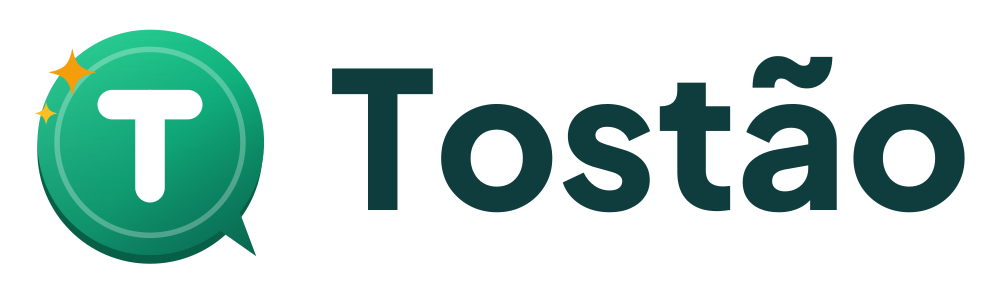
</picture>

#### seu agente financeiro por conversa

**Controle seu dinheiro em 5 segundos por dia, só conversando.**

Conceito de app de finanças pessoais com IA, criado com **Vibe Coding** para o desafio da [DIO](https://www.dio.me/).


[**🌐 Site do Tostão**](https://dltechsup.github.io/dio-lab-vibe-coding-app-financas/Tostao%20Landing.dc.html) · [**💻 App web**](https://dltechsup.github.io/dio-lab-vibe-coding-app-financas/Tostao%20Web.dc.html) · [**📱 App mobile**](https://dltechsup.github.io/dio-lab-vibe-coding-app-financas/Tostao.dc.html) · [**📄 Documentação**](https://dltechsup.github.io/dio-lab-vibe-coding-app-financas/Tostao%20-%20Documentacao%20do%20Projeto.dc.html)

<a href="https://dltechsup.github.io/dio-lab-vibe-coding-app-financas/Tostao%20Landing.dc.html"></a>

</div>

---

## 📑 Sumário

1. [Resumo executivo](#-resumo-executivo)
2. [Acesse online](#-acesse-online)
3. [O problema](#-o-problema)
4. [A solução](#-a-solução)
5. [Funcionalidades](#-funcionalidades)
6. [Conheça o agente Tostão](#-conheça-o-agente-tostão)
7. [O protótipo](#-o-protótipo)
8. [Identidade visual](#-identidade-visual)
9. [Processo de Vibe Coding](#-processo-de-vibe-coding)
10. [Prompt final (PRD)](#-prompt-final-prd)
11. [Estrutura do repositório](#-estrutura-do-repositório)
12. [Arquitetura proposta](#-arquitetura-proposta)
13. [Plano de validação](#-plano-de-validação)
14. [Roadmap](#-roadmap)
15. [Reflexão: o que aprendi](#-reflexão-o-que-aprendi)
16. [Autor](#-autor)

---

## 🎯 Resumo executivo

O **Tostão** é o conceito de um app de finanças pessoais em que a pessoa organiza o dinheiro **conversando com um agente de IA**, em vez de preencher formulários. O agente entende frases em português informal, **confirma os dados antes de salvar** e responde com números reais do próprio usuário: nunca julgamento, sempre uma ação pequena e concreta.

Basta escrever *"gastei 45 no iFood ontem"* e o app registra, categoriza e atualiza o painel. Na versão web, um onboarding de 4 perguntas monta um **plano 50/30/20** adaptado à renda, e o app acompanha **metas ("caixinhas")** e sugere marcar gastos repetidos como **assinaturas**.

| | |
|---|---|
| **Público-alvo** | Iniciantes em organização financeira, 20 a 40 anos, que usam Pix no dia a dia |
| **Diferencial** | Registro em linguagem natural brasileira + agente que orienta, não só gráficos |
| **Métrica norte** | % de usuários que registram gastos em 4 ou mais dias por semana |
| **Entrega** | Landing page, app web, app mobile e documentação, criados no Claude Design e publicados no GitHub Pages |

**Personas**

| Persona | Perfil | Dor principal |
|---|---|---|
| **Ana**, 24 | CLT | *"Meu salário some e não sei onde."* |
| **Carlos**, 38 | Autônomo | *"Nunca sei quanto posso gastar."* |
| **Juliana**, 31 | Quer começar a poupar | *"Começo a guardar e desisto."* |

---

## 🌐 Acesse online

O projeto está publicado no **GitHub Pages**, direto da raiz deste repositório.

| Página | O que é | Link |
|---|---|---|
| 🌐 **Landing page** | Apresentação do produto; o botão "Começar agora" abre o app web | [Abrir](https://dltechsup.github.io/dio-lab-vibe-coding-app-financas/Tostao%20Landing.dc.html) |
| 💻 **App web** | Versão desktop completa: onboarding, plano 50/30/20, chat, voz e dados salvos no navegador | [Abrir](https://dltechsup.github.io/dio-lab-vibe-coding-app-financas/Tostao%20Web.dc.html) |
| 📱 **App mobile** | Protótipo em moldura de celular (390×844), com a identidade verde do Tostão | [Abrir](https://dltechsup.github.io/dio-lab-vibe-coding-app-financas/Tostao.dc.html) |
| 📄 **Documentação** | Visão geral do produto, estrutura, comportamento do agente e decisões técnicas | [Abrir](https://dltechsup.github.io/dio-lab-vibe-coding-app-financas/Tostao%20-%20Documentacao%20do%20Projeto.dc.html) |

> 💡 **Roteiro sugerido para testar:** abra o app web, responda o onboarding e escreva no chat `uber 23,90 e padaria 12`, confirme o card e veja o Painel mudar. Depois pergunte `quanto gastei com uber esse mês?`.

---

## 😩 O problema

> *"Baixei três apps de finanças. Usei cada um por uma semana."*

- **Atrito alto:** registrar cada gasto em formulários com vários campos cansa, e a maioria desiste em poucas semanas.
- **Orçamento parece punição:** planilhas e limites soam técnicos e chatos.
- **Dados sem direção:** os apps mostram gráficos, mas não dizem **o que fazer** com eles.

## 💡 A solução

Trocar o formulário pela **conversa** e o gráfico passivo por um **consultor ativo**.

| Apps tradicionais | Tostão |
|---|---|
| Abrir o app, tocar em "+", preencher valor, categoria, data e descrição | Escrever *"uber 23,90 e padaria 12"* e confirmar |
| Escolher a categoria manualmente | A IA categoriza e, se não reconhecer, **cria a categoria** com a palavra que o usuário usou |
| Montar o orçamento do zero | Plano 50/30/20 gerado em 4 perguntas |
| Esquecer as assinaturas que se repetem | O app sugere marcar gastos repetidos como **recorrentes** |
| Gráficos sem interpretação | Cada gráfico vem com um insight em linguagem simples |

---

## ✨ Funcionalidades

| Funcionalidade | Como funciona | 📱 Mobile | 💻 Web |
|---|---|:---:|:---:|
| 💬 **Registro por conversa** | Entende frases informais e vários gastos numa frase, com card **Confirmar / Corrigir** antes de salvar | ✅ | ✅ |
| 🏷️ **Categorização inteligente** | Sugere a categoria; quando não reconhece (ex.: *"almoço"*), cria na hora uma categoria com esse nome | ✅ | ✅ |
| 🔎 **Consultas sobre os próprios dados** | *"Como estou no mês?"*, *"quanto gastei com uber esse mês?"*, *"minhas metas"* | ✅ | ✅ |
| 📊 **Painel** | "Livre para gastar", receitas × despesas, maiores categorias e caixinhas | ✅ | ✅ |
| 🧾 **Transações** | Lista agrupada por dia, com busca e filtro por categoria | ✅ | ✅ |
| 🎯 **Caixinhas (metas)** | Progresso, prazo, aporte mensal sugerido e criação de novas metas | ✅ | ✅ |
| 📈 **Relatórios com insights** | Rosca por categoria, histórico mensal e filtro de período, com frase do agente | ✅ | ✅ |
| 🧭 **Onboarding e plano 50/30/20** | 4 perguntas (nome, renda, gastos fixos, objetivo) geram necessidades, desejos e poupança | — | ✅ |
| 🔁 **Assinaturas recorrentes** | *"Isso parece uma assinatura. Quer marcar como recorrente?"* | — | ✅ |
| 🎙️ **Entrada por voz** | Reconhecimento de fala do navegador em pt-BR | — | ✅ |
| 💾 **Dados salvos no navegador** | Transações, caixinhas, categorias e nome sobrevivem ao recarregar a página | — | ✅ |
| ⚙️ **Configurações** | Nome do usuário e categorias criadas manualmente | — | ✅ |
| 🤖 **Perguntas gerais sobre finanças** | Respondidas por um modelo de linguagem com a persona do Tostão | — | ⚠️ |

<sub>✅ funciona · ⚠️ funciona só dentro do Claude Design (veja as [limitações conhecidas](#limitações-conhecidas)) · — não existe nesta versão</sub>

<details>
<summary><b>🧪 Exemplos de linguagem natural</b></summary>

| O usuário escreve | O Tostão registra |
|---|---|
| `gastei 45 no ifood ontem` | Despesa · R$ 45,00 · Alimentação › Delivery · ontem |
| `uber 23,90 e padaria 12` | **Duas** despesas: Transporte › App e Alimentação › Mercado |
| `caiu o salário, 3.500` | Receita · R$ 3.500,00 · Salário |
| `50 conto de gasolina` | Despesa · R$ 50,00 · Transporte › Combustível |
| `guardei 200 na viagem` | Aporte de R$ 200,00 na caixinha "Viagem" |
| `almoço 32` | Despesa · R$ 32,00 · categoria nova "Almoço" |
| `quanto gastei com uber esse mês?` | Resposta com o valor calculado das transações |

</details>

### 🧠 Como o chat entende o usuário

A cada frase, o agente decide entre três caminhos:

1. **Registro de transação:** identifica valor, categoria, data e descrição e mostra um card de confirmação. **Nada é gravado sem o usuário confirmar.**
2. **Consulta sobre os próprios dados:** perguntas como *"como estou no mês?"* são respondidas com números calculados na hora.
3. **Pergunta geral sobre finanças:** quando a frase não é registro nem consulta, o app web envia a pergunta a um modelo de linguagem, que responde como o Tostão.


---

## 🤖 Conheça o agente Tostão

Um consultor financeiro **amigo e educador, nunca julgador**.

- Celebra o progresso antes de apontar problemas.
- Toda crítica vem com **uma ação pequena e concreta**.
- Usa **números reais** do usuário, nunca exemplos genéricos.
- Não recomenda produtos financeiros específicos.

> **Registro:** *"Anotado! R$ 45 em Delivery 🍔 Você ainda tem R$ 155 livres nessa categoria."*
>
> **Plano:** *"Oi, Ana! Sou o Tostão 🪙 Seu plano: R$ 1.750,00 em necessidades, R$ 1.050,00 em desejos, R$ 700,00 em poupança."*
>
> **Consulta:** *"Você gastou R$ 68,80 com Uber esse mês, em 3 transações."*

<p align="center">
  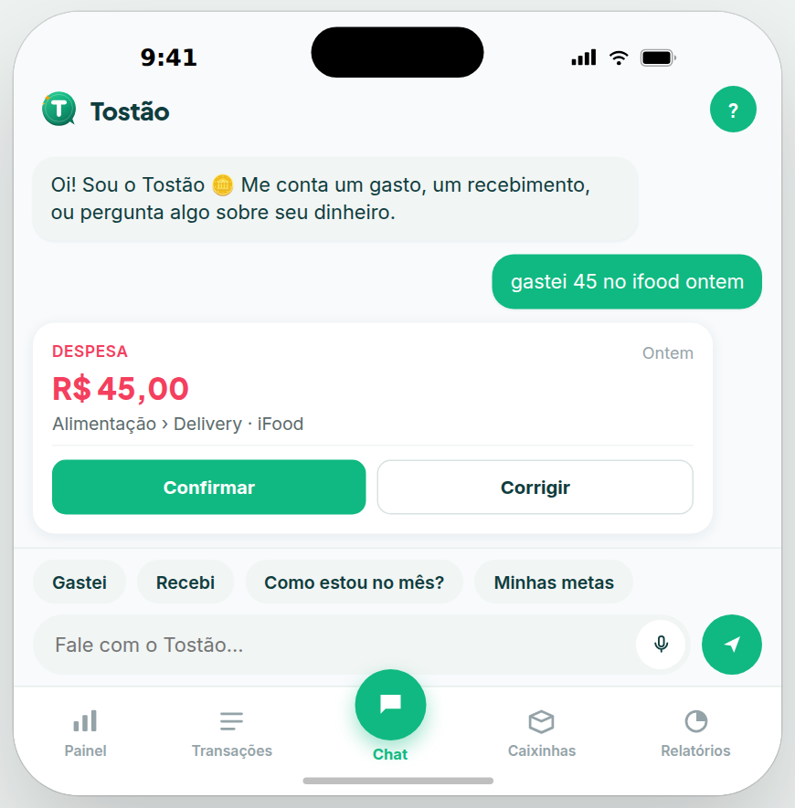
</p>
<p align="center"><sub>Card de confirmação no app mobile: o gasto só é salvo depois do "Confirmar".</sub></p>

---

## 📱 O protótipo

O Tostão tem **três telas de entrada**, todas navegáveis:

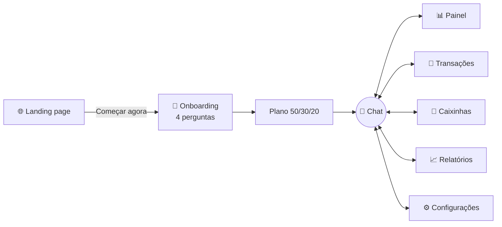

### 💻 App web

Versão desktop com navegação lateral e o fluxo completo, do onboarding ao relatório. [**Abrir o app web**](https://dltechsup.github.io/dio-lab-vibe-coding-app-financas/Tostao%20Web.dc.html)

| Onboarding: plano 50/30/20 | Chat: dois gastos numa frase |
|:---:|:---:|
|  | 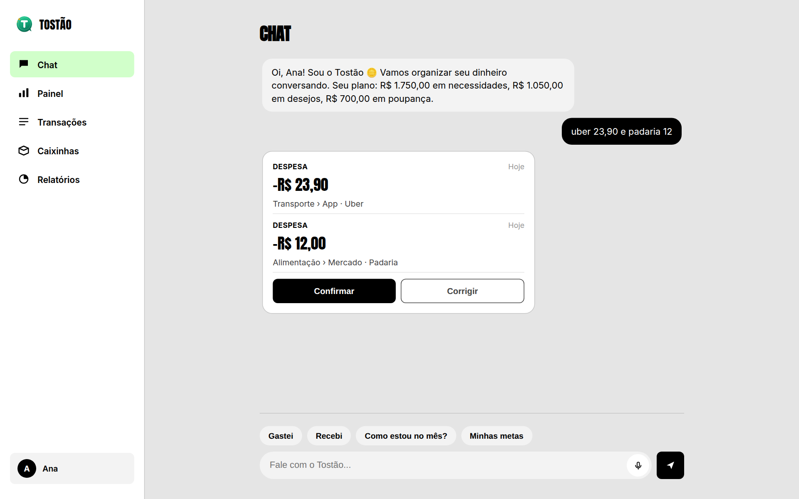 |
| **Painel** | **Transações com sugestão de assinatura** |
| 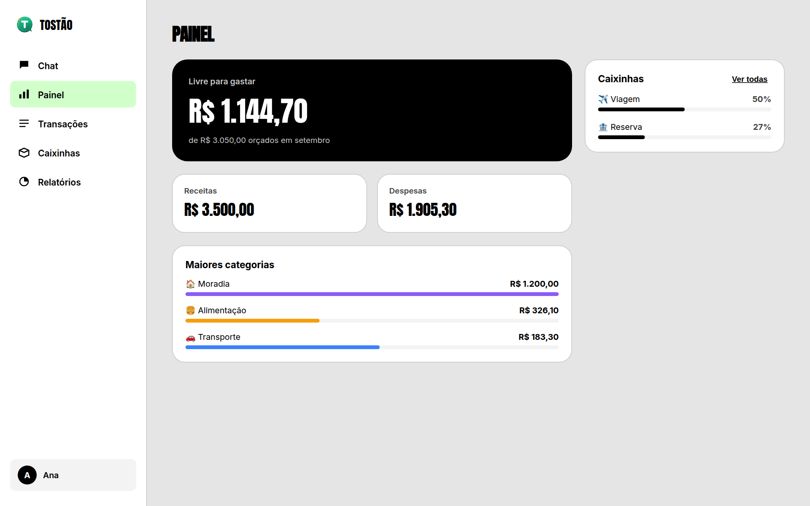 | 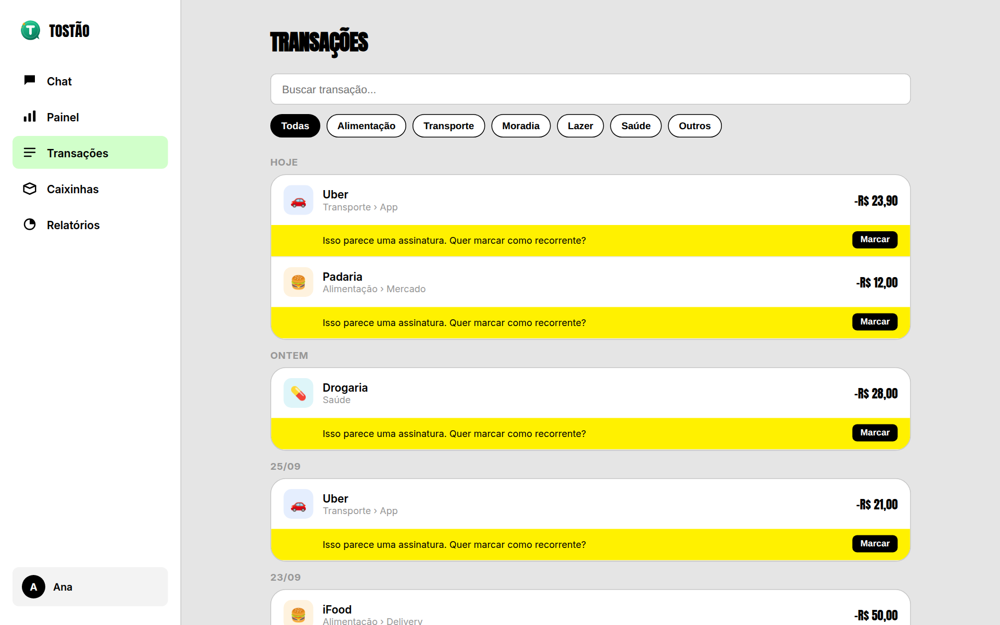 |
| **Caixinhas** | **Relatórios** |
| 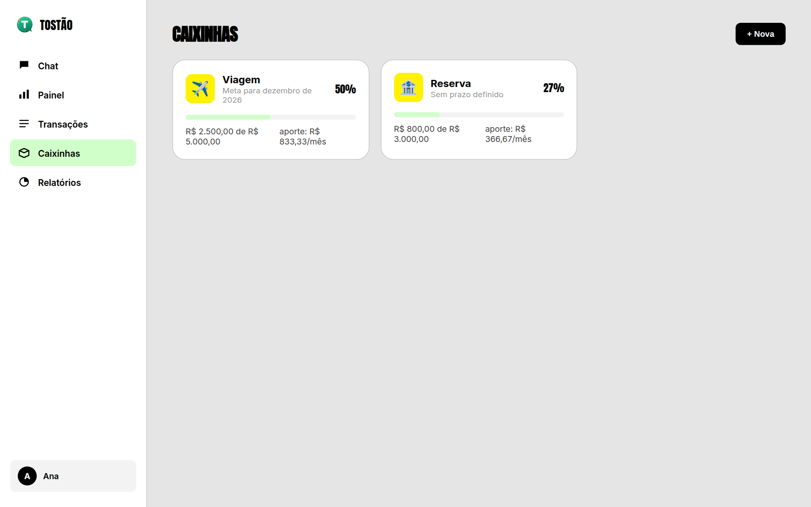 | 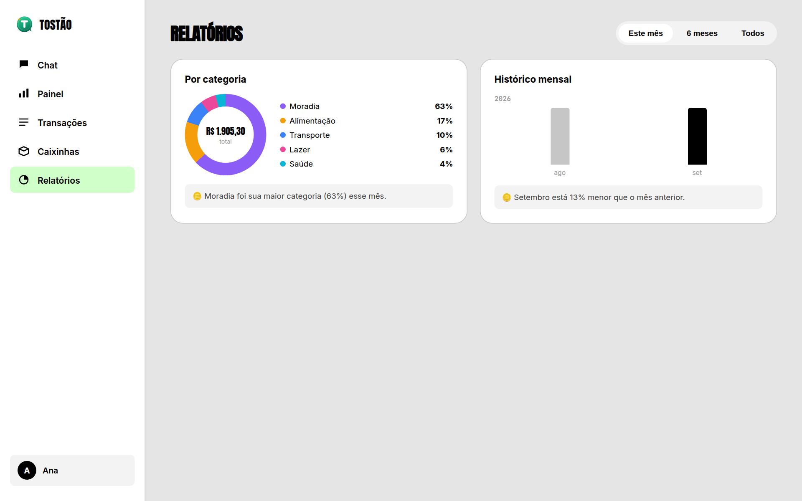 |

### 📱 App mobile

Protótipo em moldura de celular, fiel à identidade verde do Tostão. [**Abrir o app mobile**](https://dltechsup.github.io/dio-lab-vibe-coding-app-financas/Tostao.dc.html)

| Painel | Transações | Caixinhas | Relatórios |
|:---:|:---:|:---:|:---:|
|  | 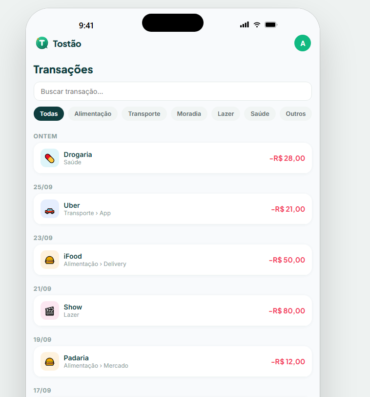 |  |  |
| "Livre para gastar", receitas × despesas, maiores categorias e caixinhas | Lista agrupada por dia, busca e filtro por categoria | Metas com progresso, prazo e aporte mensal sugerido | Rosca por categoria e histórico, com insight do agente |

<p align="center">
  
  <br/><sub>O agente respondendo "Como estou no mês?" e "Minhas metas" com os números da usuária.</sub>
</p>

### 🌐 Landing page

Hero com o slogan e o chat em ação, 3 benefícios, "Como funciona" em 3 passos e chamada para o app. [**Abrir a landing page**](https://dltechsup.github.io/dio-lab-vibe-coding-app-financas/Tostao%20Landing.dc.html)

<details>
<summary><b>Ver a landing page completa</b></summary>

<p align="center">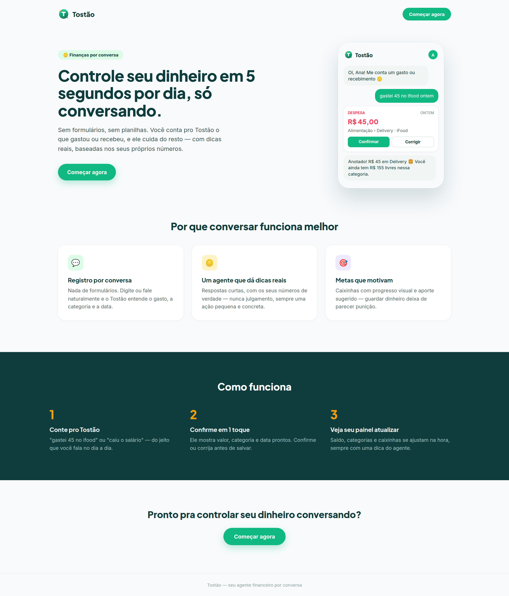</p>

</details>

### Decisões técnicas do protótipo

- **Persistência local (web):** transações, caixinhas, categorias, nome e onboarding ficam no `localStorage` e sobrevivem a recarregamentos.
- **Entrada por voz (web):** o microfone usa a Web Speech API do navegador em pt-BR, e a transcrição é enviada como se tivesse sido digitada.
- **Interpretação local:** registros e consultas são interpretados no próprio navegador, por isso respondem na hora e funcionam no site publicado.
- **Respostas abertas (web):** perguntas gerais usam `window.claude.complete`, a ponte de IA do Claude Design, com um prompt de sistema que define a persona do Tostão.

### Limitações conhecidas

- **Perguntas gerais sobre finanças só funcionam dentro do Claude Design.** No GitHub Pages essa ponte de IA não existe, e o agente responde *"Não consegui responder agora"* e sugere um registro. Registros e consultas sobre os próprios dados funcionam normalmente. Na versão de produto, essa chamada passaria por um backend (veja a [arquitetura proposta](#-arquitetura-proposta)).
- **A sugestão de assinatura é uma regra simples** e hoje aparece em muitos gastos que não são assinaturas.
- **O app mobile não salva os dados** ao recarregar a página e não tem voz: o botão de microfone só coloca o foco no campo de texto.
- **A entrada por voz depende do navegador:** funciona no Chrome e no Edge, mas não em todos os navegadores.

---

## 🎨 Identidade visual

<table>
<tr>
<td width="220" align="center">

</td>
<td>

**O conceito da marca**

- 🪙 **Moeda:** círculo com borda e espessura; o nome vem do tostão, antiga moeda brasileira.
- 💬 **Balão de conversa:** a ponta no canto inferior representa o chat, o coração da experiência.
- ✨ **Brilho âmbar:** sinaliza a inteligência artificial e os momentos de conquista.

O "T" arredondado e o verde-esmeralda transmitem acolhimento e crescimento, longe da frieza dos bancos tradicionais.

</td>
</tr>
</table>

**Variações da marca**

| Fundo claro | Fundo escuro |
|:---:|:---:|
|  | 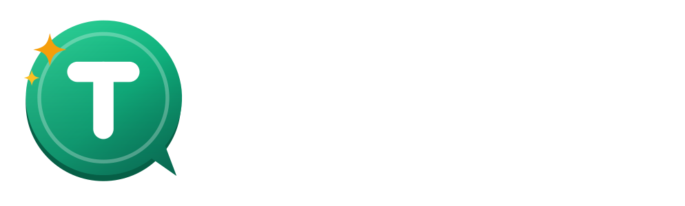 |

| Ícone do app | PWA | Favicon |
|:---:|:---:|:---:|
|  |  |  |

**Duas direções visuais**

A landing page e o app mobile usam a **identidade principal** do Tostão. O app web explora uma **direção editorial** em preto e branco, criada no Claude Design a partir de uma referência de estilo ([`uploads/DESIGN (1).md`](uploads/DESIGN%20%281%29.md)), mantendo o logo e a mesma experiência.

| | Identidade principal (landing e mobile) | Direção editorial (app web) |
|---|---|---|
| **Fundo** |  `#F8FAFC` |  `#E5E5E5` |
| **Primária** |  `#10B981` |  `#000000` |
| **Secundária** |  `#0F3D3E` |  `#FFFFFF` |
| **Destaques** |  `#F59E0B` IA e conquistas |  `#D1FFCA` e  `#FFF100` |
| **Receita / despesa** |  `#22C55E` /  `#F43F5E` | Preto, com sinal de menos nas despesas |
| **Tipografia** | [Plus Jakarta Sans](https://fonts.google.com/specimen/Plus+Jakarta+Sans) + [Inter](https://fonts.google.com/specimen/Inter) | [Anton](https://fonts.google.com/specimen/Anton) + Inter + [JetBrains Mono](https://fonts.google.com/specimen/JetBrains+Mono) |

---

## 🪄 Processo de Vibe Coding

O projeto foi feito **sem escrever código manualmente**: o trabalho foi definir intenção, contexto e critérios claros para a IA.

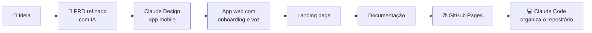

| Etapa | Ferramenta | O que foi feito |
|---|---|---|
| 1 | IA conversacional | Transformar o modelo de PRD da DIO em um briefing completo: personas, exemplos e identidade visual |
| 2 | Claude Design | App mobile: chat funcional, painel, transações, caixinhas e relatórios |
| 3 | Claude Design | App web: onboarding com plano 50/30/20, assinaturas recorrentes, voz, dados salvos no navegador e direção visual editorial |
| 4 | Claude Design | Landing page de apresentação |
| 5 | Claude Design | Documentação do projeto |
| 6 | GitHub Pages | Publicação do site direto da raiz do repositório |
| 7 | Claude Code | Organização do repositório, marca em SVG, capturas de tela e README |

**Estratégia de prompts:** em vez de pedidos soltos, o PRD foi dividido em 5 mensagens de escopo fechado, cada uma construindo sobre a anterior. Assim, cada interação tinha um objetivo claro e verificável. Priorizei o fluxo principal (conversar → confirmar → ver o painel atualizado); modo escuro, alertas de limite e resumo semanal ficaram no [roadmap](#-roadmap).

---

## 📝 Prompt final (PRD)

Briefing completo usado no Claude Design, também disponível em [`docs/PRD-Claude-Design.md`](docs/PRD-Claude-Design.md).

<details>
<summary><b>📄 Clique para expandir o PRD</b></summary>

> Briefing usado no Claude Design. A Mensagem 1 cria o protótipo base; as Mensagens 2 a 5 são enviadas uma por vez, na ordem.

## Mensagem 1 — Protótipo base

Crie o protótipo interativo de alta fidelidade do **Tostão**, um app mobile de finanças pessoais em que o usuário controla o dinheiro **conversando com um agente de IA**, sem formulários. Slogan: "Controle seu dinheiro em 5 segundos por dia, só conversando." Tudo em português do Brasil, valores em R$ (formato R$ 1.234,56) e datas dd/mm.

Use o arquivo anexado (logo-tostao.svg) como logo e ícone do app: uma moeda verde em forma de balão de conversa, com a letra T branca e um brilho âmbar.

### Problema
Pessoas abandonam apps de finanças porque registrar cada gasto em formulários é cansativo, orçamento parece punição e os apps mostram números sem dizer o que fazer com eles.

### Público
Iniciantes em organização financeira, de 20 a 40 anos, que usam Pix no dia a dia. Personas: Ana (24, CLT, "meu salário some e não sei onde"), Carlos (38, autônomo, "nunca sei quanto posso gastar") e Juliana (31, "começo a guardar e desisto").

### Formato
Protótipo navegável em moldura de celular (390×844), com barra inferior de 5 abas: **Chat** (central e destacada), **Painel**, **Transações**, **Caixinhas** e **Relatórios**. Perfil no avatar do topo.

### Dados de exemplo
Usuária "Ana", renda de R$ 3.500, com 2 meses de transações realistas (iFood, Uber, mercado, aluguel de R$ 1.200, Netflix, farmácia, salário), limites por categoria e 2 caixinhas: "Viagem ✈️" (R$ 2.500 de R$ 5.000, prazo dezembro) e "Reserva 🛟" (R$ 800 de R$ 3.000).

### Telas
1. **Chat (principal):** conversa com o agente Tostão, campo fixo embaixo com botão de microfone e atalhos rápidos ("Gastei", "Recebi", "Como estou no mês?", "Minhas metas").
2. **Painel:** saldo do mês, destaque "Livre para gastar", receitas × despesas, 3 maiores categorias e progresso das caixinhas.
3. **Transações:** lista agrupada por dia, busca e filtro por categoria, com ícone e cor de cada categoria.
4. **Caixinhas:** metas com emoji, barra de progresso, valor-alvo, prazo e aporte mensal sugerido.
5. **Relatórios:** rosca por categoria, barras dos últimos 6 meses e comparação com o mês anterior, cada gráfico com uma frase de insight do agente.

### O chat precisa funcionar de verdade
Ao digitar uma frase e enviar, o protótipo interpreta o texto e mostra um **card de confirmação** com valor, categoria, data e descrição, mais os botões **Confirmar** e **Corrigir**. Ao confirmar, a transação entra na lista e o Painel atualiza. Exemplos que devem funcionar:
- "gastei 45 no ifood ontem" → Despesa · R$ 45,00 · Alimentação › Delivery · ontem
- "uber 23,90 e padaria 12" → **duas** despesas (Transporte e Alimentação)
- "caiu o salário, 3.500" → Receita · R$ 3.500,00 · Salário
- "50 conto de gasolina" → Despesa · R$ 50,00 · Transporte › Combustível
- "guardei 200 na viagem" → aporte na caixinha Viagem
- "quanto gastei com uber esse mês?" → resposta com o valor calculado dos dados

### Personalidade do agente Tostão
Consultor amigo e educador, nunca julgador. Frases curtas (no máximo 3), no máximo 1 emoji, sempre com números reais da usuária. Celebra o progresso antes de apontar problemas, e toda crítica vem com uma ação pequena e concreta. Não recomenda produtos financeiros específicos. Exemplos:
- "Anotado! R$ 45 em Delivery 🍔 Você ainda tem R$ 155 livres nessa categoria."
- "Opa, Lazer já está em 80% do limite e ainda faltam 12 dias. Quer que eu ajuste o plano?"
- "Caixinha Viagem chegou a 50%! No ritmo atual você bate a meta em novembro."

### Identidade visual
Fintech moderna e acolhedora, no nível de Nubank e Revolut.
- Cores: primária #10B981, secundária #0F3D3E, destaque #F59E0B (IA e conquistas), receita #22C55E, despesa #F43F5E, fundo #F8FAFC.
- Tipografia: Plus Jakarta Sans em títulos e valores grandes, Inter nos textos.
- Cards com cantos de 16px, sombras suaves, microanimações na entrada de mensagens e nas barras de progresso.
- Contraste AA e áreas de toque de 44px.

Priorize que o fluxo **"digitar um gasto → confirmar → ver o Painel atualizado"** funcione perfeitamente.

## Mensagem 2 — Onboarding e plano de economia

Adicione antes do Chat um onboarding conversacional com 4 perguntas do Tostão: nome, renda mensal (aceita "é variável"), gastos fixos (chips: aluguel, contas, internet, transporte, escola) e objetivo principal (chips: sair das dívidas, criar reserva, juntar pra algo, só organizar). No final, o agente apresenta um card com o plano de economia 50/30/20 adaptado, com limites por categoria e botão "Começar". Inclua também um exemplo de alerta de 80% do limite e um resumo semanal automático no chat.

## Mensagem 3 — Detalhes do produto

Refine a tela de Relatórios com filtro por período e insights do agente em cada gráfico. Nas Transações, adicione a sugestão "Isso parece uma assinatura. Quer marcar como recorrente?" para gastos repetidos, e mostre que, ao corrigir uma categoria, o app lembra da preferência. Crie também a tela de Perfil com renda, limites por categoria, alternância de tema e o aviso "O Tostão é um assistente educativo e não substitui orientação financeira profissional."

## Mensagem 4 — Modo escuro e versão desktop

Crie o modo escuro completo (fundo #0B1215) e uma versão desktop do app, com o chat à direita e o painel à esquerda. Adicione estados vazios ilustrados e amigáveis para quando não houver transações ou caixinhas. Revise a consistência de espaçamento, tipografia e cores em todas as telas.

## Mensagem 5 — Landing page

Crie uma landing page de apresentação do Tostão: hero com o slogan e o celular mostrando o chat, 3 benefícios (registro por conversa, agente que dá dicas reais, metas que motivam), seção "Como funciona" em 3 passos e botão "Experimentar o protótipo".

</details>

---

## 🗂️ Estrutura do repositório

Os arquivos do site ficam na **raiz** porque o GitHub Pages publica a partir dela.

```
📦 dio-lab-vibe-coding-app-financas
├── index.html                                 # redireciona para a landing page
├── Tostao Landing.dc.html                     # landing page
├── Tostao Web.dc.html                         # app web (desktop)
├── Tostao.dc.html                             # app mobile (moldura de celular)
├── Tostao - Documentacao do Projeto.dc.html   # documentação do produto
├── support.js · doc-page.js · ios-frame.jsx   # runtime exportado do Claude Design
├── logo-tostao.svg                            # logo usado pelas páginas
├── uploads/                                   # arquivos de referência enviados ao Claude Design
│   └── DESIGN (1).md                          # referência de estilo do app web
├── docs/
│   ├── PRD-Claude-Design.md                   # prompt final (PRD)
│   ├── assets/                                # logo e wordmarks em SVG
│   ├── prints/                                # capturas de tela usadas neste README
│   └── prototipo/                             # zip exportado do Claude Design (primeira versão mobile)
└── README.md
```

<details>
<summary><b>Como rodar localmente</b></summary>

1. Clone o repositório.
2. Na raiz, rode `python -m http.server 8000` (ou qualquer servidor estático).
3. Abra `http://localhost:8000` no navegador.

É preciso estar conectado à internet, porque as páginas carregam o React e as fontes do Google por CDN.

</details>

---

## 🏗️ Arquitetura proposta

O protótipo valida a experiência. Para virar produto, esta é a arquitetura planejada:

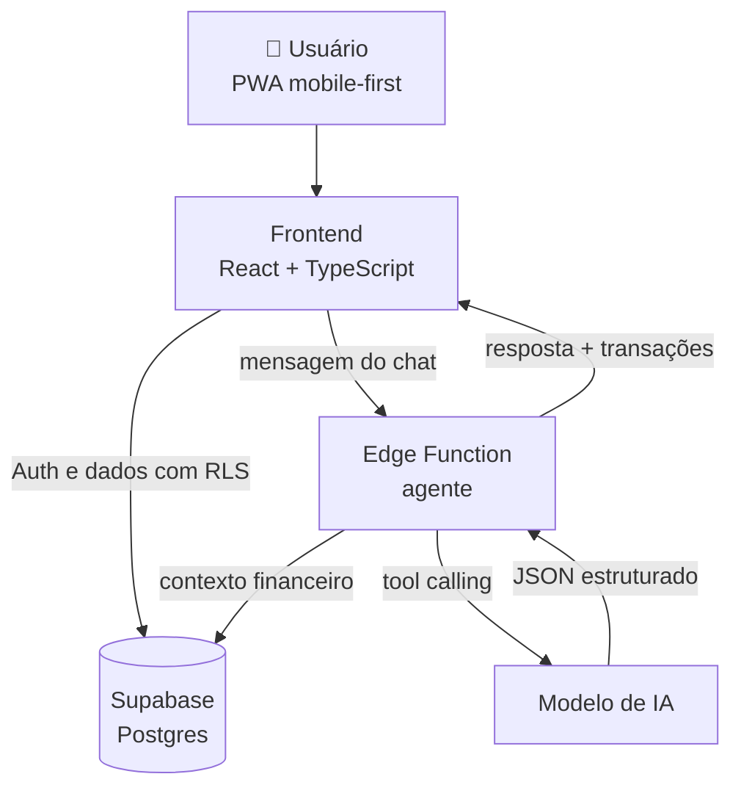

- **IA no servidor:** a chamada ao modelo passa por uma função no backend, sem expor chaves no navegador. É isso que substitui a ponte `window.claude.complete`, que só existe no Claude Design.
- **Saída estruturada:** o agente devolve JSON (`intencao`, `transacoes`, `meta`, `aporte`, `resposta`), o que torna o registro previsível e testável.
- **Confirmação humana:** nada é salvo sem o usuário confirmar o card, evitando erros silenciosos da IA.
- **Privacidade (LGPD):** dados isolados por usuário, com exportação e exclusão da conta.

---

## 📏 Plano de validação

**Hipóteses**

1. Registrar por conversa aumenta a frequência de registro em comparação com formulários.
2. Dicas personalizadas geram mudança real no comportamento de gasto.
3. Metas com progresso visual aumentam a retenção.

| Métrica | Meta de sucesso |
|---|---|
| Tempo para registrar um gasto | < 5 segundos |
| Acerto da categorização automática | ≥ 85% sem correção |
| Usuários que registram em 4+ dias por semana | ≥ 40% |
| Retenção na semana 4 | ≥ 30% |
| Usuários com ao menos 1 caixinha ativa | ≥ 50% |
| NPS após 2 semanas | ≥ 40 |

**Primeiro teste:** 5 a 10 pessoas do público-alvo navegando no [site publicado](https://dltechsup.github.io/dio-lab-vibe-coding-app-financas/Tostao%20Landing.dc.html) com tarefas guiadas ("registre um gasto", "crie uma meta"), medindo tempo, erros e percepção.

---

## 🧭 Roadmap

- [x] PRD e conceito do produto
- [x] Identidade visual
- [x] App mobile interativo
- [x] App web com onboarding 50/30/20, voz, assinaturas recorrentes e dados salvos no navegador
- [x] Landing page e documentação
- [x] Site publicado no GitHub Pages
- [ ] Respostas de IA funcionando fora do Claude Design (backend próprio)
- [ ] Modo escuro completo
- [ ] Alertas de 80% do limite e resumo semanal no chat
- [ ] Detecção de assinaturas mais precisa
- [ ] Teste de usabilidade com o público-alvo
- [ ] MVP funcional (React + Supabase + IA)
- [ ] Open Finance e Pix no lugar dos dados de exemplo
- [ ] Leitura de comprovante e integração com WhatsApp

---

## 🧠 Reflexão: o que aprendi

<!-- ✏️ Revise com a sua experiência real antes de publicar. -->

**✅ O que funcionou bem**

- Tratar o PRD como um **contrato**, com personas, exemplos e identidade visual definidos, fez a IA acertar a estrutura logo na primeira geração.
- Dar **exemplos de entrada e saída** (*"uber 23,90 e padaria 12" → duas transações*) funcionou melhor do que descrever regras em abstrato.
- Dividir o trabalho em mensagens com escopo fechado deixou cada etapa mais precisa.

**⚠️ O que não saiu como esperado**

- O plano inicial era usar o Lovable, mas ele exige créditos pagos. Troquei para o Claude Design e adaptei o PRD de "app com backend" para "protótipo interativo", o que me obrigou a separar o que é **experiência** do que é **infraestrutura**.
- Ao publicar no GitHub Pages, as respostas abertas do agente pararam de funcionar, porque dependiam de um recurso que só existe dentro do Claude Design. Foi um lembrete prático de que protótipo e produto têm infraestruturas diferentes.
- Pedidos muito amplos geravam telas superficiais; pedidos específicos, com critérios claros, geravam resultados melhores.

**💡 O que aprendi sobre conversar com IAs**

- A qualidade da resposta acompanha a clareza da intenção: **contexto, restrições e exemplos** valem mais do que adjetivos como "bonito" ou "profissional".
- Definir **o que fica de fora** é tão importante quanto definir o que entra.
- Vibe Coding não é "pedir e aceitar": é **dirigir**, revisar e iterar, como um gerente de produto trabalhando com um time muito rápido.

---

## 👤 Autor


**DLTechSup**<br/>
Conceito, PRD e direção do produto

[](https://github.com/DLTechSup)

<div align="center">

<sub>Projeto desenvolvido para o desafio **Vibe Coding: App de Finanças Pessoais** da DIO.<br/>O Tostão é um conceito educativo e não substitui orientação financeira profissional.</sub>

</div>
