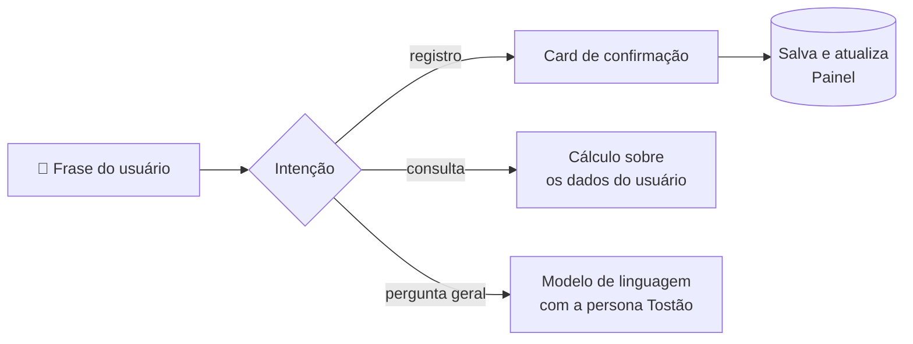
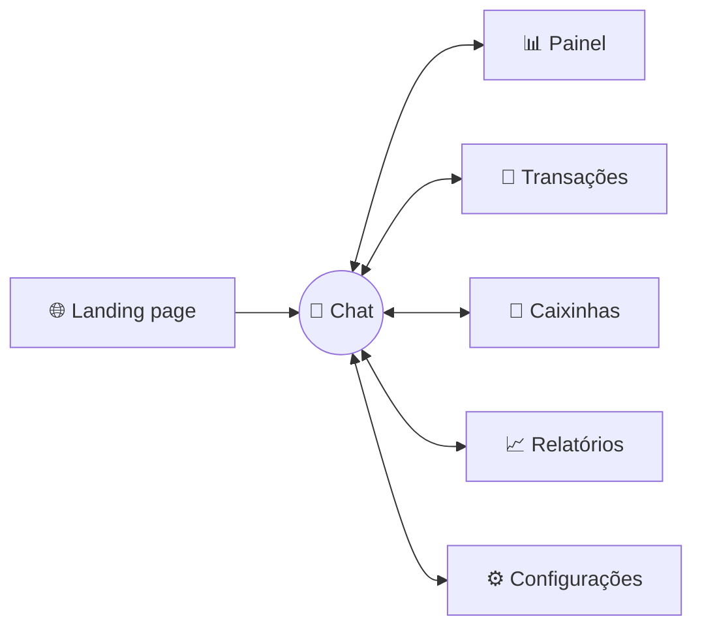
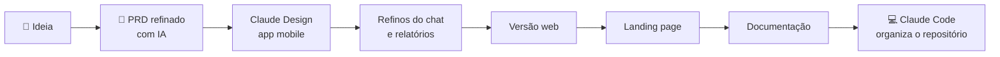
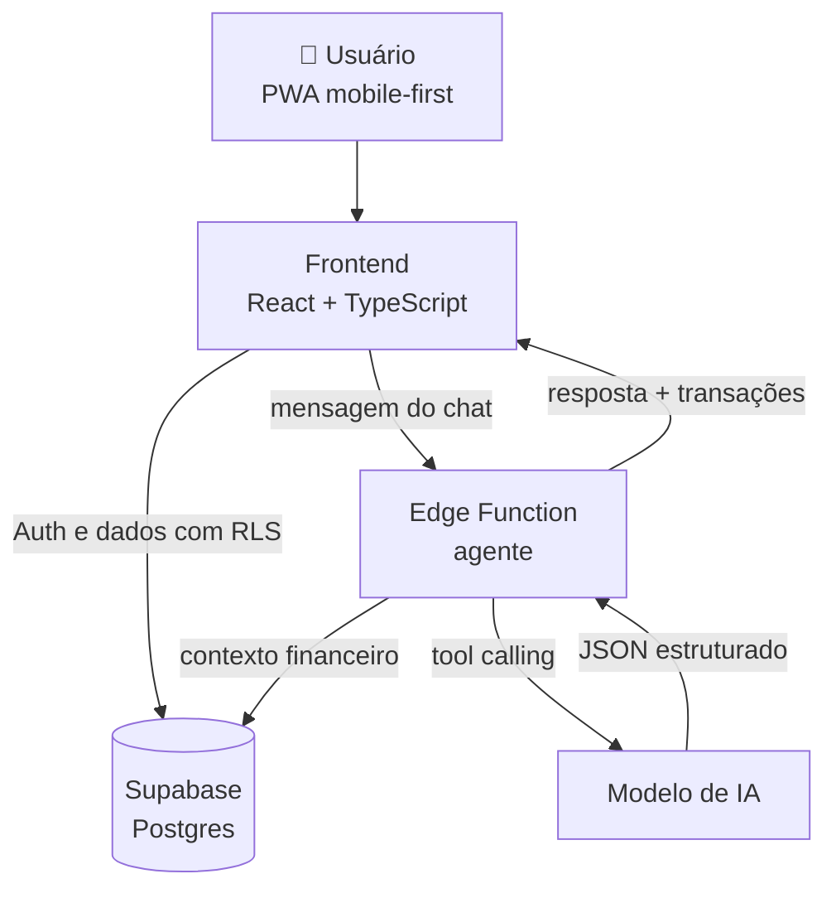

<picture>
  <source media="(prefers-color-scheme: dark)" srcset="docs/assets/wordmark-dark.svg" />
  
</picture>

#### seu agente financeiro por conversa

**Controle seu dinheiro em 5 segundos por dia, só conversando.**

Conceito de app de finanças pessoais com IA, criado com **Vibe Coding** para o desafio da [DIO](https://www.dio.me/).

[**🚀 Abrir o protótipo**](LINK_DO_PROTOTIPO) · [**📄 PRD completo**](docs/PRD-Claude-Design.md) · [**🎬 Vídeo de demonstração**](LINK_DO_VIDEO)

---

## 📑 Sumário

1. [Resumo executivo](#-resumo-executivo)
2. [O problema](#-o-problema)
3. [A solução](#-a-solução)
4. [Funcionalidades](#-funcionalidades)
5. [Conheça o agente Tostão](#-conheça-o-agente-tostão)
6. [O protótipo](#-o-protótipo)
7. [Identidade visual](#-identidade-visual)
8. [Processo de Vibe Coding](#-processo-de-vibe-coding)
9. [Prompt final (PRD)](#-prompt-final-prd)
10. [Arquitetura proposta](#-arquitetura-proposta)
11. [Plano de validação](#-plano-de-validação)
12. [Roadmap](#-roadmap)
13. [Reflexão: o que aprendi](#-reflexão-o-que-aprendi)
14. [Autor](#-autor)

---

## 🎯 Resumo executivo

O **Tostão** é o conceito de um app de finanças pessoais em que a pessoa organiza o dinheiro **conversando com um agente de IA**, em vez de preencher formulários. O agente entende frases em português informal, **confirma os dados antes de salvar** e responde com números reais do próprio usuário: nunca julgamento, sempre uma ação pequena e concreta. Basta escrever *"gastei 45 no iFood ontem"* e o app registra, categoriza e atualiza o painel. O agente acompanha **metas ("caixinhas")**, responde perguntas sobre os próprios gastos e tira dúvidas gerais de finanças.

| | |
|---|---|
| **Público-alvo** | Iniciantes em organização financeira, 20 a 40 anos, que usam Pix no dia a dia |
| **Diferencial** | Registro em linguagem natural brasileira + agente proativo, não só gráficos |
| **Métrica norte** | % de usuários que registram gastos em 4 ou mais dias por semana |

**Personas**

| Persona | Perfil | Dor principal |
|---|---|---|
| **Ana**, 24 | CLT | *"Meu salário some e não sei onde."* |
| **Carlos**, 38 | Autônomo | *"Nunca sei quanto posso gastar."* |
| **Juliana**, 31 | Quer começar a poupar | *"Começo a guardar e desisto."* |
| **Entrega** | Protótipo interativo mobile e web, landing page e documentação, criados no Claude Design |

---

## 😩 O problema

> *"Baixei três apps de finanças. Usei cada um por uma semana."*

- **Atrito alto:** registrar cada gasto em formulários com vários campos cansa, e a maioria desiste em poucas semanas.
- **Orçamento parece punição:** planilhas e limites soam técnicos e chatos.
- **Dados sem direção:** os apps mostram gráficos, mas não dizem **o que fazer** com eles.

## 💡 A solução

Trocar o formulário pela **conversa** e o gráfico passivo por um **consultor ativo**.

| Apps tradicionais | Tostão |
|---|---|
| Abrir o app, tocar em "+", preencher valor, categoria, data e descrição | Escrever *"uber 23,90 e padaria 12"* e confirmar |
| Escolher a categoria manualmente | A IA categoriza e, se não reconhecer, **cria a categoria** com a palavra que o usuário usou |
| Montar o orçamento do zero | Plano 50/30/20 gerado em 4 perguntas |
| Descobrir o estouro no fim do mês | Alerta em 80% do limite, com sugestão de ação |
| Gráficos sem interpretação | Cada gráfico vem com um insight em linguagem simples |

---

## ✨ Funcionalidades

| # | Funcionalidade | Como funciona | Status |
|---|---|---|:---:|
| **F1** | 💬 Registro por chat e voz | Entende frases informais e vários gastos numa frase (*"50 conto de gasolina"*), com card **Confirmar / Corrigir**. O microfone usa o reconhecimento de fala do navegador (pt-BR) | ✅ |
| **F2** | 🏷️ Categorização inteligente | Sugere a categoria; quando não reconhece (ex.: *"almoço"*), cria na hora uma categoria com o nome dito pelo usuário, em vez de jogar em "Outros" | ✅ |
| **F3** | 🎯 Caixinhas (metas) | Progresso, prazo e aporte mensal sugerido; o usuário cria novas metas e faz aportes pelo chat | ✅ |
| **F4** | 🤖 Agente Tostão | Responde sobre os próprios dados (*"quanto gastei com uber esse mês?"*, *"relatório de agosto"*) e também dúvidas gerais de finanças, sempre com a mesma persona | ✅ |
| **F5** | 📊 Relatórios com insights | Distribuição por categoria, últimos 6 meses, comparação com o mês anterior e filtro de período, com insight do agente | ✅ |
| **F6** | ⚙️ Configurações | Nome do usuário e categorias criadas manualmente | ✅ |
| **F7** | 🧭 Onboarding e plano 50/30/20 | Plano de economia adaptado à renda, com limites por categoria e alertas em 80% | 🔜 |
| **F8** | 🔁 Assinaturas recorrentes | Detectar gastos repetidos e sugerir marcá-los como recorrentes | 🔜 |
| **F9** | 🌙 Modo escuro | Tema escuro completo (fundo `#0B1215`) | 🔜 |

✅ funcionando no protótipo · 🔜 planejado para a próxima versão

<b>🧪 Exemplos de linguagem natural</b>

| O usuário escreve | O Tostão registra |
|---|---|
| `gastei 45 no ifood ontem` | Despesa · R$ 45,00 · Alimentação › Delivery · ontem |
| `uber 23,90 e padaria 12` | **Duas** despesas: Transporte e Alimentação |
| `caiu o salário, 3.500` | Receita · R$ 3.500,00 · Salário |
| `50 conto de gasolina` | Despesa · R$ 50,00 · Transporte › Combustível |
| `guardei 200 na viagem` | Aporte de R$ 200,00 na caixinha "Viagem" |
| `quanto gastei com uber esse mês?` | Resposta com o valor calculado |

### 🧠 Como o chat entende o usuário

A cada frase digitada ou falada, o agente decide entre três caminhos:

1. **Registro de transação:** identifica valor, categoria, data e descrição e mostra um card de confirmação. **Nada é gravado sem o usuário confirmar.**
2. **Consulta sobre os próprios dados:** perguntas como *"quanto ainda tenho?"* ou *"relatório de agosto"* são respondidas com números calculados na hora sobre as transações do usuário.
3. **Pergunta geral sobre finanças:** quando a frase não é um registro nem uma consulta, o agente usa um modelo de linguagem para responder, mantendo o tom do Tostão.

---

## 🤖 Conheça o agente Tostão

Um consultor financeiro **amigo e educador, nunca julgador**.

- Celebra o progresso antes de apontar problemas.
- Toda crítica vem com **uma ação pequena e concreta**.
- Usa **números reais** do usuário, nunca exemplos genéricos.
- Não recomenda produtos financeiros; em decisões complexas, indica um profissional.

> **Registro:** *"Anotado! R$ 45 em Delivery 🍔 Você ainda tem R$ 155 livres nessa categoria."*
>
> **Alerta:** *"Opa, Lazer já está em 80% do limite e ainda faltam 12 dias. Quer que eu ajuste o plano?"*
>
> **Conquista:** *"Caixinha Viagem chegou a 50%! No ritmo atual você bate a meta em novembro."*

  
   O agente respondendo com os números reais da usuária: saldo livre, despesas e progresso das caixinhas.

---

## 📱 O protótipo

[**▶️ Abrir o protótipo interativo**](LINK_DO_PROTOTIPO)

📦 **Código do protótipo:** [`docs/prototipo/Tostao-prototipo-claude-design.zip`](docs/prototipo/Tostao-prototipo-claude-design.zip), exportado do Claude Design.

<b>Como rodar localmente</b>

1. Baixe e descompacte o zip.
2. Na pasta descompactada, rode `python -m http.server 8000` (ou qualquer servidor estático).
3. Abra `http://localhost:8000/Tostao.dc.html` no navegador.

É preciso estar conectado à internet, porque o protótipo carrega o React e as fontes do Google por CDN.

**Entregáveis**

| Entregável | Descrição |
|---|---|
| 📱 **App mobile** (`Tostao.dc.html`) | Moldura de celular 390×844, com abas na parte de baixo e o Chat em destaque |
| 💻 **App web** (`Tostao Web.dc.html`) | Versão desktop com navegação lateral, entrada por voz e persistência local |
| 🌐 **Landing page** (`Tostao Landing.dc.html`) | Página de apresentação do produto |
| 📄 **Documentação** | Visão geral, personas, estrutura, comportamento do agente e decisões técnicas |

**Decisões técnicas do protótipo**

- **Persistência local:** transações, caixinhas, categorias e nome do usuário ficam salvos no navegador e sobrevivem a recarregamentos.
- **Entrada por voz:** o microfone usa o reconhecimento de fala do navegador em pt-BR, e a transcrição é enviada como se tivesse sido digitada.
- **Respostas abertas:** perguntas que não são sobre os dados do usuário vão para um modelo de linguagem, que responde mantendo a persona do Tostão.

| Painel | Transações | Caixinhas | Relatórios |
|:---:|:---:|:---:|:---:|
|  |  |  |  |
| "Livre para gastar", receitas × despesas, maiores categorias e caixinhas | Lista agrupada por dia, busca e filtro por categoria | Metas com progresso, prazo e aporte mensal sugerido | Rosca por categoria e últimos 6 meses, com insight do agente |

---

## 🎨 Identidade visual

<table>
<tr>
<td width="220" align="center">

</td>
<td>

**O conceito da marca**

- 🪙 **Moeda:** círculo com borda e espessura; o nome vem do tostão, antiga moeda brasileira.
- 💬 **Balão de conversa:** a ponta no canto inferior representa o chat, o coração da experiência.
- ✨ **Brilho âmbar:** sinaliza a inteligência artificial e os momentos de conquista.

O "T" arredondado e o verde-esmeralda transmitem acolhimento e crescimento, longe da frieza dos bancos tradicionais.

</td>
</tr>
</table>

**Variações da marca**

| Fundo claro | Fundo escuro |
|:---:|:---:|
|  |  |

| Ícone do app | PWA | Favicon |
|:---:|:---:|:---:|
|  |  |  |

**Paleta de cores**

| Amostra | Hex | Uso |
|:---:|---|---|
|  | `#10B981` | Primária: marca, botões e progresso |
|  | `#0F3D3E` | Secundária: títulos e destaques |
|  | `#F59E0B` | IA, alertas e conquistas |
|  | `#22C55E` | Receitas |
|  | `#F43F5E` | Despesas |
|   | `#F8FAFC` / `#0B1215` | Fundos claro e escuro |

**Tipografia:** [Plus Jakarta Sans](https://fonts.google.com/specimen/Plus+Jakarta+Sans) na marca, títulos e valores · [Inter](https://fonts.google.com/specimen/Inter) nos textos.

---

## 🪄 Processo de Vibe Coding

O projeto foi feito **sem escrever código manualmente**: o trabalho foi definir intenção, contexto e critérios claros para a IA.

| Etapa | Ferramenta | O que foi feito |
|---|---|---|
| 1 | IA conversacional | Transformar o modelo de PRD da DIO em um briefing completo: personas, exemplos, identidade visual |
| 2 | Claude Design | App mobile: chat funcional, painel, transações, caixinhas e relatórios |
| 3 | Claude Design | Refinos: filtro de período e insights nos relatórios, categorias criadas pelo chat, respostas gerais sobre finanças e tela de configurações |
| 4 | Claude Design | Versão web com navegação lateral, entrada por voz e persistência local |
| 5 | Claude Design | Landing page de apresentação |
| 6 | Claude Design | Documentação do projeto |
| 7 | Claude Code | Organização do repositório, marca em SVG e README |

> 🎬 **Vídeo das interações:** [assista aqui](LINK_DO_VIDEO)

**Estratégia de prompts:** em vez de pedidos soltos, o PRD foi dividido em 5 mensagens de escopo fechado, cada uma construindo sobre a anterior. Assim, cada interação tinha um objetivo claro e verificável. Na prática, priorizei o fluxo principal (conversar → confirmar → ver o painel atualizado), a versão web e a landing page; onboarding com plano 50/30/20, assinaturas recorrentes e modo escuro ficaram no [roadmap](#-roadmap).

---

## 📝 Prompt final (PRD)

Briefing completo usado no Claude Design, também disponível em [`docs/PRD-Claude-Design.md`](docs/PRD-Claude-Design.md).

<b>📄 Clique para expandir o PRD</b>

> Briefing usado no Claude Design. A Mensagem 1 cria o protótipo base; as Mensagens 2 a 5 são enviadas uma por vez, na ordem.

## Mensagem 1 — Protótipo base

Crie o protótipo interativo de alta fidelidade do **Tostão**, um app mobile de finanças pessoais em que o usuário controla o dinheiro **conversando com um agente de IA**, sem formulários. Slogan: "Controle seu dinheiro em 5 segundos por dia, só conversando." Tudo em português do Brasil, valores em R$ (formato R$ 1.234,56) e datas dd/mm.

Use o arquivo anexado (logo-tostao.svg) como logo e ícone do app: uma moeda verde em forma de balão de conversa, com a letra T branca e um brilho âmbar.

### Problema
Pessoas abandonam apps de finanças porque registrar cada gasto em formulários é cansativo, orçamento parece punição e os apps mostram números sem dizer o que fazer com eles.

### Público
Iniciantes em organização financeira, de 20 a 40 anos, que usam Pix no dia a dia. Personas: Ana (24, CLT, "meu salário some e não sei onde"), Carlos (38, autônomo, "nunca sei quanto posso gastar") e Juliana (31, "começo a guardar e desisto").

### Formato
Protótipo navegável em moldura de celular (390×844), com barra inferior de 5 abas: **Chat** (central e destacada), **Painel**, **Transações**, **Caixinhas** e **Relatórios**. Perfil no avatar do topo.

### Dados de exemplo
Usuária "Ana", renda de R$ 3.500, com 2 meses de transações realistas (iFood, Uber, mercado, aluguel de R$ 1.200, Netflix, farmácia, salário), limites por categoria e 2 caixinhas: "Viagem ✈️" (R$ 2.500 de R$ 5.000, prazo dezembro) e "Reserva 🛟" (R$ 800 de R$ 3.000).

### Telas
1. **Chat (principal):** conversa com o agente Tostão, campo fixo embaixo com botão de microfone e atalhos rápidos ("Gastei", "Recebi", "Como estou no mês?", "Minhas metas").
2. **Painel:** saldo do mês, destaque "Livre para gastar", receitas × despesas, 3 maiores categorias e progresso das caixinhas.
3. **Transações:** lista agrupada por dia, busca e filtro por categoria, com ícone e cor de cada categoria.
4. **Caixinhas:** metas com emoji, barra de progresso, valor-alvo, prazo e aporte mensal sugerido.
5. **Relatórios:** rosca por categoria, barras dos últimos 6 meses e comparação com o mês anterior, cada gráfico com uma frase de insight do agente.

### O chat precisa funcionar de verdade
Ao digitar uma frase e enviar, o protótipo interpreta o texto e mostra um **card de confirmação** com valor, categoria, data e descrição, mais os botões **Confirmar** e **Corrigir**. Ao confirmar, a transação entra na lista e o Painel atualiza. Exemplos que devem funcionar:
- "gastei 45 no ifood ontem" → Despesa · R$ 45,00 · Alimentação › Delivery · ontem
- "uber 23,90 e padaria 12" → **duas** despesas (Transporte e Alimentação)
- "caiu o salário, 3.500" → Receita · R$ 3.500,00 · Salário
- "50 conto de gasolina" → Despesa · R$ 50,00 · Transporte › Combustível
- "guardei 200 na viagem" → aporte na caixinha Viagem
- "quanto gastei com uber esse mês?" → resposta com o valor calculado dos dados

### Personalidade do agente Tostão
Consultor amigo e educador, nunca julgador. Frases curtas (no máximo 3), no máximo 1 emoji, sempre com números reais da usuária. Celebra o progresso antes de apontar problemas, e toda crítica vem com uma ação pequena e concreta. Não recomenda produtos financeiros específicos. Exemplos:
- "Anotado! R$ 45 em Delivery 🍔 Você ainda tem R$ 155 livres nessa categoria."
- "Opa, Lazer já está em 80% do limite e ainda faltam 12 dias. Quer que eu ajuste o plano?"
- "Caixinha Viagem chegou a 50%! No ritmo atual você bate a meta em novembro."

### Identidade visual
Fintech moderna e acolhedora, no nível de Nubank e Revolut.
- Cores: primária #10B981, secundária #0F3D3E, destaque #F59E0B (IA e conquistas), receita #22C55E, despesa #F43F5E, fundo #F8FAFC.
- Tipografia: Plus Jakarta Sans em títulos e valores grandes, Inter nos textos.
- Cards com cantos de 16px, sombras suaves, microanimações na entrada de mensagens e nas barras de progresso.
- Contraste AA e áreas de toque de 44px.

Priorize que o fluxo **"digitar um gasto → confirmar → ver o Painel atualizado"** funcione perfeitamente.

## Mensagem 2 — Onboarding e plano de economia

Adicione antes do Chat um onboarding conversacional com 4 perguntas do Tostão: nome, renda mensal (aceita "é variável"), gastos fixos (chips: aluguel, contas, internet, transporte, escola) e objetivo principal (chips: sair das dívidas, criar reserva, juntar pra algo, só organizar). No final, o agente apresenta um card com o plano de economia 50/30/20 adaptado, com limites por categoria e botão "Começar". Inclua também um exemplo de alerta de 80% do limite e um resumo semanal automático no chat.

## Mensagem 3 — Detalhes do produto

Refine a tela de Relatórios com filtro por período e insights do agente em cada gráfico. Nas Transações, adicione a sugestão "Isso parece uma assinatura. Quer marcar como recorrente?" para gastos repetidos, e mostre que, ao corrigir uma categoria, o app lembra da preferência. Crie também a tela de Perfil com renda, limites por categoria, alternância de tema e o aviso "O Tostão é um assistente educativo e não substitui orientação financeira profissional."

## Mensagem 4 — Modo escuro e versão desktop

Crie o modo escuro completo (fundo #0B1215) e uma versão desktop do app, com o chat à direita e o painel à esquerda. Adicione estados vazios ilustrados e amigáveis para quando não houver transações ou caixinhas. Revise a consistência de espaçamento, tipografia e cores em todas as telas.

## Mensagem 5 — Landing page

Crie uma landing page de apresentação do Tostão: hero com o slogan e o celular mostrando o chat, 3 benefícios (registro por conversa, agente que dá dicas reais, metas que motivam), seção "Como funciona" em 3 passos e botão "Experimentar o protótipo".

---

## 🏗️ Arquitetura proposta

O protótipo valida a experiência. Para virar produto, esta é a arquitetura planejada:

- **IA no servidor:** a chamada ao modelo passa por uma função no backend, sem expor chaves no navegador.
- **Saída estruturada:** o agente devolve JSON (`intencao`, `transacoes`, `meta`, `aporte`, `resposta`), o que torna o registro previsível e testável.
- **Confirmação humana:** nada é salvo sem o usuário confirmar o card, evitando erros silenciosos da IA.
- **Privacidade (LGPD):** dados isolados por usuário, com exportação e exclusão da conta.

---

## 📏 Plano de validação

**Hipóteses**

1. Registrar por conversa aumenta a frequência de registro em comparação com formulários.
2. Dicas personalizadas geram mudança real no comportamento de gasto.
3. Metas com progresso visual aumentam a retenção.

| Métrica | Meta de sucesso |
|---|---|
| Tempo para registrar um gasto | < 5 segundos |
| Acerto da categorização automática | ≥ 85% sem correção |
| Usuários que registram em 4+ dias por semana | ≥ 40% |
| Retenção na semana 4 | ≥ 30% |
| Usuários com ao menos 1 caixinha ativa | ≥ 50% |
| NPS após 2 semanas | ≥ 40 |

**Primeiro teste:** 5 a 10 pessoas do público-alvo navegando no protótipo com tarefas guiadas ("registre um gasto", "crie uma meta"), medindo tempo, erros e percepção.

---

## 🧭 Roadmap

- [x] PRD e conceito do produto
- [x] Identidade visual
- [x] Protótipo mobile interativo no Claude Design
- [x] Versão web com voz e persistência local
- [x] Landing page e documentação
- [ ] Onboarding com plano de economia 50/30/20 e alertas de limite
- [ ] Detecção automática de assinaturas recorrentes
- [ ] Modo escuro completo
- [ ] Teste de usabilidade com o público-alvo
- [ ] MVP funcional (React + Supabase + IA)
- [ ] Open Finance e Pix no lugar dos dados de exemplo
- [ ] Leitura de comprovante e integração com WhatsApp

---

## 🧠 Reflexão: o que aprendi

<!-- ✏️ Revise com a sua experiência real antes de publicar. -->

**✅ O que funcionou bem**

- Tratar o PRD como um **contrato**, com personas, exemplos e identidade visual definidos, fez a IA acertar a estrutura logo na primeira geração.
- Dar **exemplos de entrada e saída** (*"uber 23,90 e padaria 12" → duas transações*) funcionou melhor do que descrever regras em abstrato.
- Dividir o trabalho em mensagens com escopo fechado deixou cada etapa mais precisa.

**⚠️ O que não saiu como esperado**

- O plano inicial era usar o Lovable, mas ele exige créditos pagos. Troquei para o Claude Design e adaptei o PRD de "app com backend" para "protótipo interativo", o que me obrigou a separar o que é **experiência** do que é **infraestrutura**.
- Pedidos muito amplos geravam telas superficiais; pedidos específicos, com critérios claros, geravam resultados melhores.

**💡 O que aprendi sobre conversar com IAs**

- A qualidade da resposta acompanha a clareza da intenção: **contexto, restrições e exemplos** valem mais do que adjetivos como "bonito" ou "profissional".
- Definir **o que fica de fora** é tão importante quanto definir o que entra.
- Vibe Coding não é "pedir e aceitar": é **dirigir**, revisar e iterar, como um gerente de produto trabalhando com um time muito rápido.

---

## 👤 Autor

**Jakero** · Showcial Media 
Conceito, PRD e direção do produto

Projeto desenvolvido para o desafio **Vibe Coding: App de Finanças Pessoais** da DIO. O Tostão é um conceito educativo e não substitui orientação financeira profissional.

